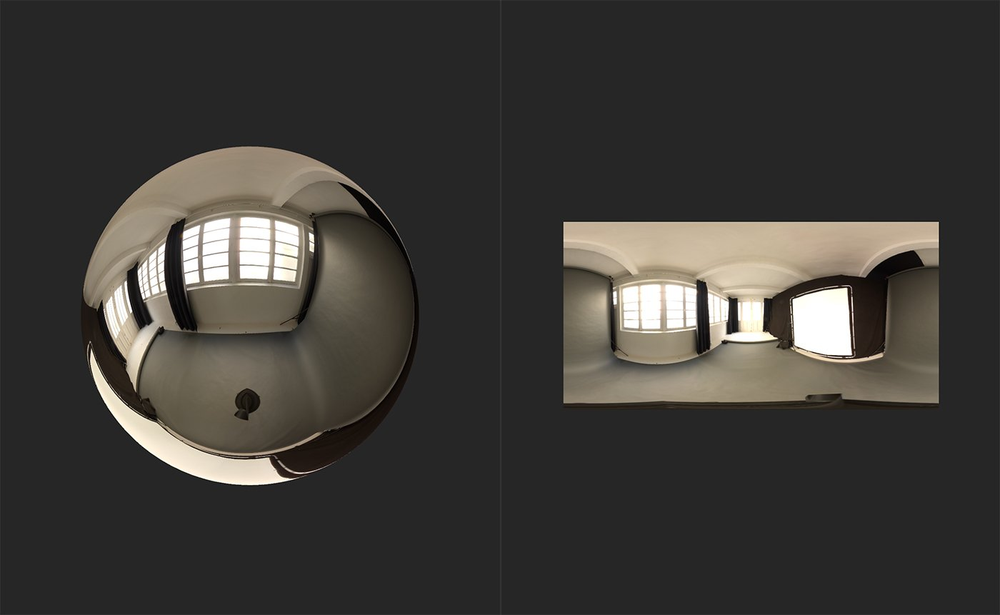
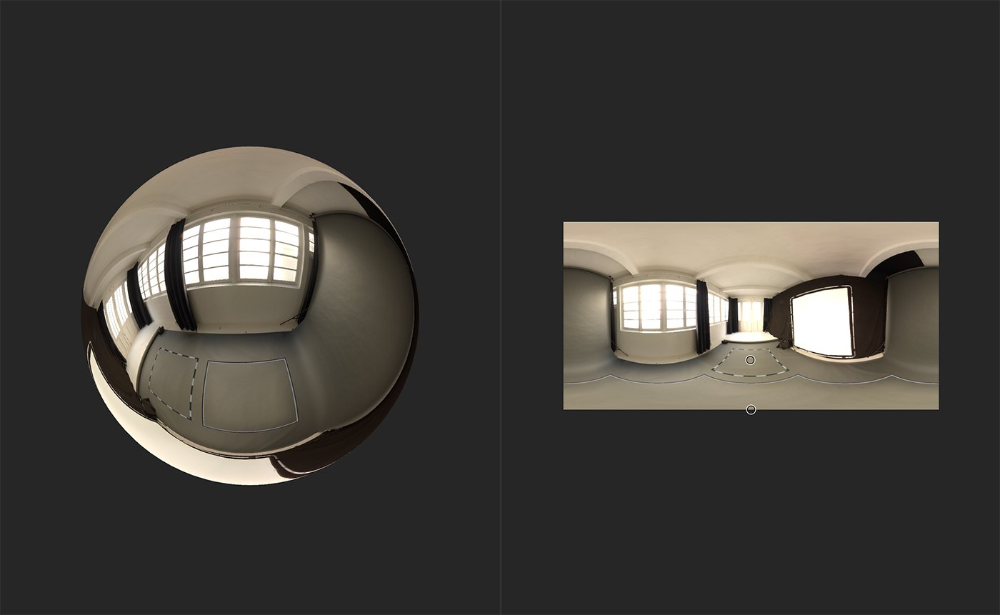

# Nadir Patch

<table>
<tr style="border: 0;">
<td width="41.60%" style="border: 0;" valign="top">

**In:** HDRI Tools

</td>
<td width="58.30%" style="border: 0;" valign="top">

## Description

Patch the nadir of your environment light to hide artifacts or seams.

In the images below, you can see how **Nadir Patch** is used to remove the camera stand in this panoramic image.

</td>
</tr>
</table>

## Parameters

**Basic parameters**

* **Enable**: toggle  
  Switch the patch on or off - this can be useful to quickly see the impact of the patch without having to change the layer visibility.
* **Show Frames Helper**: toggle  
  Switch the Frames on or off.
* **Frame Thickness**: 0-1  
  Adjust the thickness of the frame. This can be helpful when the source of the patch is far from the nadir.
* **Patch Scale**: 0-1  
  Adjust the boundary of the area to be patched.
* **Patch Size**:  
  Adjust the dimensions of the patch.
* **Patch Rotation**: 0-1  
  Rotate the patch boundaries. This rotates both the source and the patch location, so the patch will still have the same orientation. To rotate the patch in place, use **Source Rotation Offset**.
* **Patch Alpha**:  
  Select the shape used to mask the patch. If **Mask Input** is selected, an additional parameter will appear:  
  * **Mask Input**: image/brush  
    Import an image to use as a mask, or paint a mask directly in the **2D view**.
* **Patch Hardness**: 0-1  
  Adjust the blur on the edges of the patch mask.
* **Source Rotation Offset**: 0-1  
  Offset the rotation of the source - this has the effect of rotating the patch.

## Usage Guide

A common issue that an occur when creating an environment light from photographs is artifacts occurring around the top and bottom nadirs of the texture. The **Nadir Patch** **filter** helps to minimize these issues.

1. Add the **Nadir Patch filter** to the top of the layer stack.
1. Use the handle in the **2D view** to change the source location for the patch.
   1. The patched nadir changes depending on the location of the source. If the source is in the bottom half of the texture space, the bottom nadir will be patched; if the source is in the top half, the top nadir will be patched.
1. Modify the parameters to fine tune the transform of the patch to best hide seams and artifacts.

 