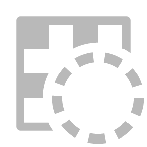
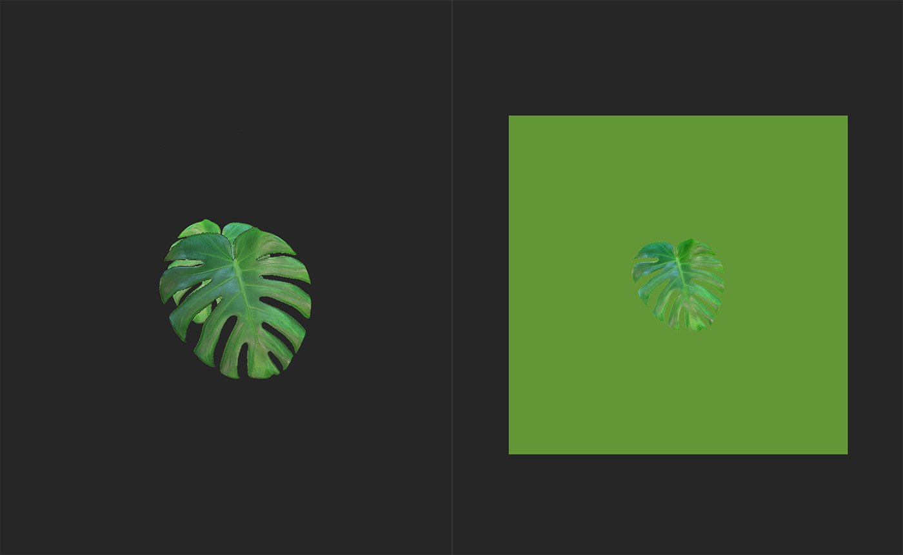

# Atlas Splitter

<table>
<tr style="border: 0;">
<td width="41.60%" style="border: 0;" valign="top">

**In:** Tools

</td>
<td width="58.30%" style="border: 0;" valign="top">

## Description

The **Atlas Splitter** is a useful tool to organize and view the elements of an atlas.

The images below show the **Atlas Splitter** in action.

The above image shows an atlas material added to the layer stack. use the **Atlas Splitter** to select specific elements from the atlas.

With the **Atlas Splitter** added to the layer stack, it's possible to focus on a single leaf, or any other element of the atlas material.

</td>
</tr>
</table>

## Parameters

**Basic parameters**

* **Grid View**: toggle  
  Switch between grid view and individual view of elements. If enabled the following additional parameters appear:
  * **Grid Opacity**: 0-1  
    Modify the opacity of the grid
  * **Grid Selection Opacity**: 0-1  
    Modify the opacity of the border around the selected element
  * **Auto Scale**: toggle  
    Switch whether atlas elements are scaled to fill each grid square or not.
* **Auto Crop**: toggle  
  Select whether to adjust the crop of the selected shape. If enabled an additional option will appear:
  * **Auto Crop Mode**:   
    Choose how the selected element is cropped to fill the space of the material.
* **Shape Selection**: 1-10  
  Change which element of the atlas is selected. For atlases with more than 10 elements, you can type a number into the **Shape Selection** value to change the range of the slider.
* **Rotation**: 0-1  
  Rotate elements

**Advanced Parameters**

* **Small Shape Tolerance**: 0-1  
  Adjust the minimum size of shapes to be picked up by the **Atlas Splitter**. This is useful for filtering out artifacts
* **Auto Rotation**: toggle  
  If enabled, elements will be automatically rotated to have similar orientations.
* **Downscale Opacity Mask**: 0-4  
  Adjust the scale of the opacity mask. Note that increasing this value can decrease the quality of the opacity mask.
* **Shape Detection Precision**:   
  Select which shape detection algorithm to use.
* **Dilation Width**: 0-32  
  Modify the dilation - this extrudes the colors of the element borders into the masked area to help avoid transparency issues at the edge of atlas elements. View the base color channel in the **2D view** to see the results.
* **Custom Background Color**: toggle  
  If enabled, a control appears to modify the background color of the normal channel:
  * **Normal Bg Color**: color select  
    Select the custom background color of the normal channel in transparent parts of the material.
* **Height Bg Color**: 0-1  
  Adjust the background color of the height channel. It is generally a good idea to have the height background match the average height of the borders of atlas elements to avoid artifacts at the borders of elements.
