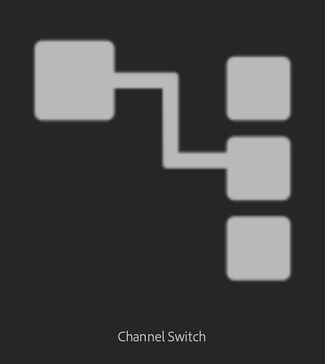

# Channel Switch

<table>
<tr style="border: 0;">
<td width="41.60%" style="border: 0;" valign="top">

</td>
<td width="58.30%" style="border: 0;" valign="top">

## Description

Switch the channels of the output maps of the material.

</td>
</tr>
</table>

## Parameters

**Basic parameters**

* **Draw Custom Weave:** Draw the weaves on your 2D viewport.
* **Input Channel:** Select which channel the filter will move.
* **Output Channel:** Select Which channel is the destination of the Input Channel.
* **Opacity:** 0-1  
  Adjust the opacity of the channel information relative to the existing channel information. In other words, this controls the opacity of the mask used to apply the new channel fill.
* **Blending Mode****:** Select the blending mode for the basecolor channel. Changing the blending mode can substantially change the appearance of the channel.

**Advanced**

* **Material Input:** Select which material to use as input.

**Mask**

* **Use Custom Mask:** toggle  
  Enable or disable the use of a custom mask. If enabled the following parameters appear:
* **Custom Mask – Blur:** 0-1  
  Blur the mask.
* **Custom Mask – Invert:** toggle  
  Invert the mask.
