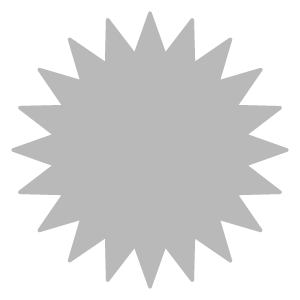

# Channels Generation

<table>
<tr style="border: 0;">
<td width="41.60%" style="border: 0;" valign="top">

**In:** Tools

</td>
<td width="58.30%" style="border: 0;" valign="top">

## Description

Description of the

</td>
</tr>
</table>

## Parameters

**Presets**

Use presets to quickly change parameters to see different styles of parquet floor.

**Basic parameters**

* **Random Seed**:  
  The random seed determines the random values of other parameters that use randomness in this filter.
* **Parameter**  **2**: 0-1

## Usage Guide
