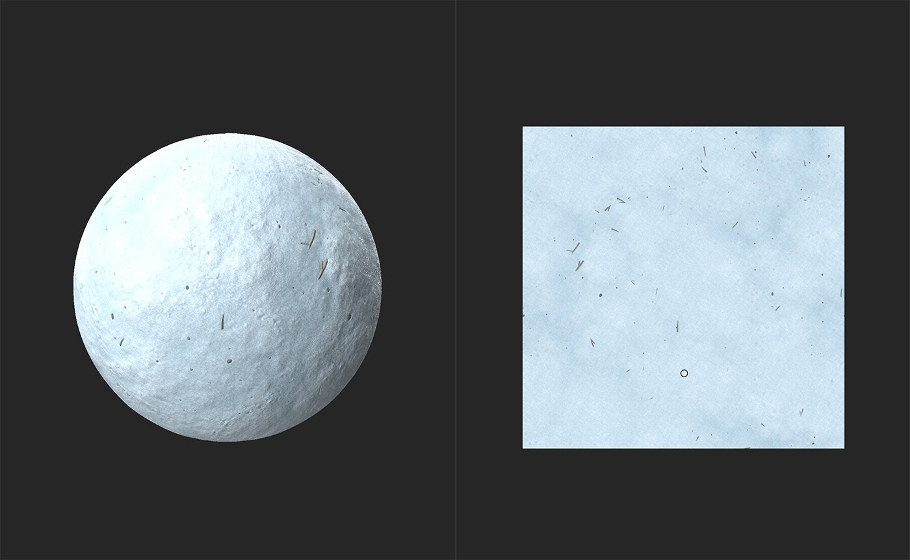
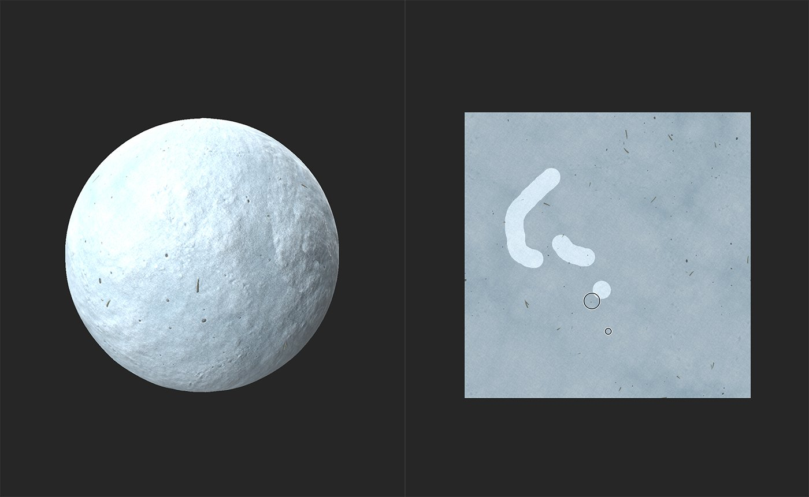
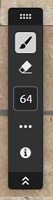

# Clone Stamp

<table>
<tr style="border: 0;">
<td width="41.60%" style="border: 0;" valign="top">

**In:** Tools

</td>
<td width="58.30%" style="border: 0;" valign="top">

## Description

The **Clone Stamp tool** helps you to manually duplicate or patch parts of your material. This is useful for fixing seams, or removing errors from your material.. The **Clone Stamp filter** is one of the tools available in the left sidebar.

The images below show the **Clone Stamp** being used to remove debris from a snow material.

In the image above, the snow material includes a number of twigs and other debris scattered around.

The **Clone Stamp** tool is used to remove some twigs and replace them with clean snow.

</td>
</tr>
</table>

## Clone Stamp tutorial

## Parameters

<b>Basic parameters</b>

* <b>Expand mask</b>: 0-1  
  Adjust how far around the painted area the filter will attempt to match the underlying material.
* <b>Fade blending</b>: 0-1  
  Soften the edge of the cloned area to help blend with the underlying material.
* <b>Blur mask</b>: 0-1  
  Adjust the amount of detail of the edge of the clone stamp. Increasing this value will make the edges of the cloned area more blob-like.
* <b>Keep ratio</b>: toggle  
  When toggled off, allows you to adjust the proportions of the stamped area.
  * <b>Horizontal</b>: 0-2
  * <b>Vertical</b>: 0-2
* <b>Rotation</b>: -180 to 180  
  Rotate the stamped area.
* <b>Flip Horizontal</b>: toggle  
  Mirror the stamped area along a horizontal axis.
* <b>Flip Vertical</b>: toggle  
  Mirror the stamped area along a vertical axis.

<b>Fade blending</b>

Use the Fade blending controls to individually adjust the Fade blending for each channel in your material.

<b>Advanced</b>

* <b>Normal intensity</b>: 0-2  
  Adjust the strength of normals in the stamped area.
* <b>Source position</b>:   
  0-1: Adjust the horizontal source position.  
  0-1: Adjust the vertical source position.
* <b>Target position</b>:  
  0-1: Adjust the horizontal target position.  
  0-1: Adjust the vertical target position.
* <b>Tiling mode</b>: dropdown  
  Enable or disable tiling.

## Usage Guide

Click the **Clone Stamp tool** to create a new Clone Stamp filter layer at the top of your layer stack. You can also add a Clone Stamp filter by using the **Add a layer button** in the **Layers panel**.

Creating a Clone Stamp filter layer automatically opens the **2D view** in the **Viewport**. A **Toolbar** appears at the top of the **2D view** when the Clone Stamp layer is selected.

{width="300px"}

To start using the Clone Stamp tool, click and drag over the problematic area in the **2D view**. The material will begin to automatically update based on the source. Areas where you use the **Clone Stamp tool** are highlighted.

## Toolbar

<table>
<tr style="border: 0;">
<td width="16.67%" style="border: 0;" valign="top">

</td>
<td width="83.33%" style="border: 0;" valign="top">

While the Clone stamp layer is selected, a toolbar appears in the 2D view with additional controls.

* Select either the <b>Brush tool </b>to add to the mask, or the <b>Erase tool </b>to remove from the mask.
* Set the size of the currently selected tool.
* Access additional controls:
  * <b>Brush tiling</b>:   
    Toggle X and Y brush tiling.
  * <b>Overlay:</b>  
    Toggle whether the overlay is shown while hovering over the 2D view.
* View 2D View controls.

</td>
</tr>
</table>

>[!NOTE]
>
> Just like other Viewport toolbars, you can drag the handle at the top of the toolbar to reposition the toolbar inside the viewport, double-click the handle to switch between vertical and horizontal mode, or use the double chevron to hide or expand the toolbar.

## Source Selection

Use Ctrl + Click in the 2D View to add a new source. Adding a new source will create an additional stamp under the Clone Stamp layer in the <b>Layers panel</b>. You can control each stamp individually.

>[!NOTE]
>
> It's usually a good idea to try avoid having the source point close to the area you're cloning over. If the source point is close to the problematic area, it's possible to clone the problematic area.

## Shortcuts

| Action | Windows + Linux | MacOs |
| --- | --- | --- |
| Increase Brush Size | &#93; or Ctrl + Mouse Wheel | &#93; or Cmd + Mouse Wheel |
| Decrease Brush Size | &#91; or Ctrl + Mouse Wheel | &#91; or Cmd + Mouse Wheel |
| Set the source | Ctrl + Left click | Cmd + Left click |
