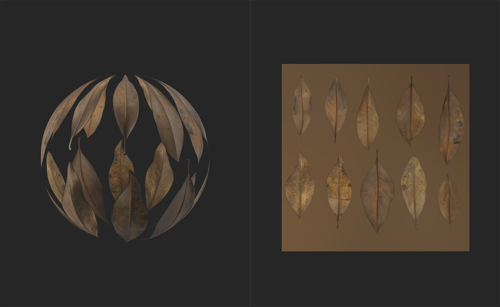
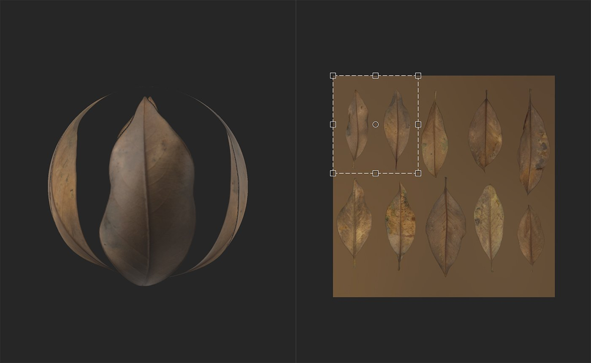
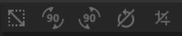

# Crop tool

<table>
<tr style="border: 0;">
<td width="41.60%" style="border: 0;" valign="top">

**In:** Tools

</td>
<td width="58.30%" style="border: 0;" valign="top">

## Description

Use the **Crop tool** To adjust the crop of your image or material. The **Crop tool** works very similarly to the **Transform tool**. With the **Transform tool**, changes to the transform box behave in a one to one fashion with the underlying image, so increasing the scale of the Transform box increases the size of the underlying image. With the **Crop tool**, this relationship is inverted, increasing the scale of the Crop box decreases the size of the underlying image. For this reason, when using the **Crop Tool**, it can be helpful to set the **2D View** to display Layer Inputs, instead of the default Material Outputs.

The **Crop tool** is useful for making adjustments to images that have non-standard aspect ratios. For example, you can use the crop tool to adjust the scale of an imported image through the Input Size parameters in the **Properties panel**.

>[!NOTE]
>
> Note that the **Crop tool** can work on either images or materials. If an image or scan channel exists in the layer stack under the **Crop layer**, the **Crop filter** will apply to the Scan channel. If no image or scan channel exists, the **Crop filter** will instead modify the material.

In the images below you can see the **Crop Tool** in action.

Note that the 2D view is set to display Layer Inputs so that the handles in the **2D view** show what area of the input will become the output.

</td>
</tr>
</table>

## Parameters

**Basic parameters**

* **Input Size**: 0-8192  
  Adjust the size of the input in pixels on the X and Y axes.

**Advanced parameters**

* **Filtering**:  
  Select the filtering method applied to the resized pixels. Bilinear filtering will blur pixels into each other, while Nearest filtering maintains the edges of pixels.
* **Crop Transform**: 0-1  
  Modify the matrix values of the transform. Editing these values can provide more accurate control over rotation and scaling, and also allow you to skew the crop handles.
* **Crop Offset**: 0-1  
  Offset the crop from the starting position.

## Usage Guide

>[!NOTE]
>
> The Crop filter has it's own resolution, it will crop and output the adequate resolution depanding on the croped material or image. To keep the best results put the above layers in Input Max and use an Upscale to enlarge the final results.

Click the **Crop tool** to add a new Crop filter layer to the top of the layer stack.

Creating or selecting a Crop filter layer automatically opens the **2D view**. With the Crop layer selected, a toolbar appears at the top of the **2D view**.

## Functionality

>[!NOTE]
>
> The Crop filter performs the inverse of the move, scale, or rotation that you request. If you find that the Crop filter doesn't feel correct, you may find Transform filter to be more useful.

### Move

To move the layer:

1. Hover your mouse within the transform box
1. Your cursor will change into four arrows
1. Click and drag to move the transform box.

### Scale

To scale the layer:

1. Hover your mouse over one of the handles at the edge or corner of the transform box
1. Your cursor will change into four arrows.
1. Click and drag to scale the transform box.

>[!NOTE]
>
> Handles on the corner of the transform box will allow you to scale in two dimensions at once, while handles at the edge of the transform box will limit you to scaling in one dimension.

### Rotate

To rotate the layer:

1. Hover your mouse outside the transform box but within the **2D view**.
1. A small horizontal arrow will appear next to your cursor.
1. Click and drag to rotate the transform box.

>[!NOTE]
>
> You can change the center of rotation by dragging the small circle at the center of the transform box. The transform box always rotates around this circle.

## Toolbar

{width="200px"}

The toolbar contains the following shortcuts:

* Make it square: Adjust the scaling of the current transformation to make it square.
* Rotation +90° (to the right): clockwise 90° rotation.
* Rotation -90° (to the left): anticlockwise 90° rotation.
* Reset rotation center: Reset the rotation center to the center of the Transform box.
* Reset transformation: Reset the Transform tool to its default position.
