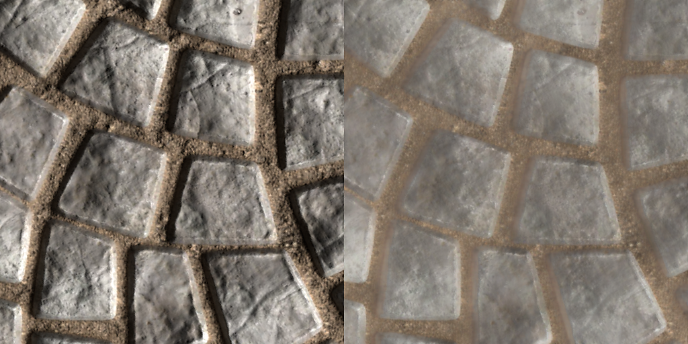
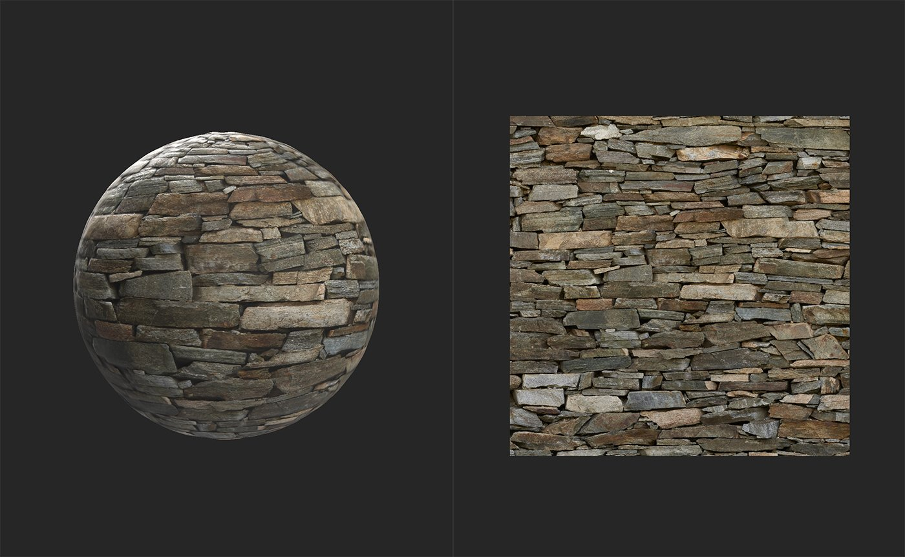
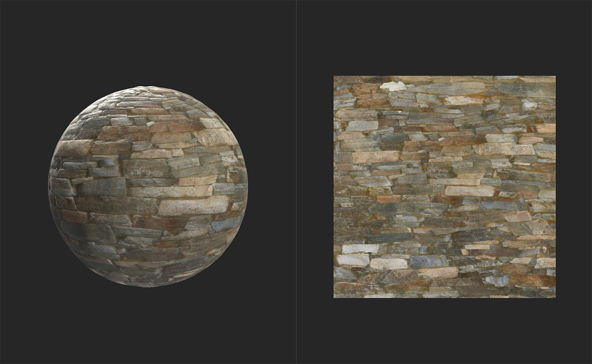

# Delight (AI Powered)

<table>
<tr style="border: 0;">
<td width="41.60%" style="border: 0;" valign="top">

**In:** Tools

</td>
<td width="58.30%" style="border: 0;" valign="top">

## Description

The Delighter allows you to remove lighting information from the base color channel. This is important when converting images to materials because generally materials should not include lighting information. A material is a collection of information that explains how light should react with a surface, so if there is already light information baked into a channel that shouldn't have light information, it can break the material's ability to represent the surface realistically.

*A**n example of an image before and after being processed by the **Delight (AI Powered) filter**. Notice that the shadows and highlights have been removed, only the base color remains.*

The images below show a material before and after being processed by a **Delight (AI Powered) filter**.

In the above image, the material still includes a substantial amount of lighting information in the base color channel. The dark shadows between bricks should not be present in the base color channel.

After the delighting pass, the shadows have been removed to create a more physically accurate base color channel. While the results in this example may not seem noticeable, delighting images is an important step of converting images into materials.

In source images, light comes from static sources, but materials need to be able to handle light coming from any angle. For example: if a source image with light shining from the top down is converted into a material without going through a delighting step, it could be displayed in a 3D space where the light shines from the bottom up. The material will quickly look out of place because it simultaneously appears to be casting shadows from multiple lights when there is only a single light source.

</td>
</tr>
</table>

## Parameters

The delighter has no parameters - it works automatically.

## Usage Guide

How to use it?

Add the **Delighter filter** to the top of the layer stack.

### When to use it?

When using **Image to Material (B2M)**, once you have extracted all channels from your images and made the material tileable, use the delighter to remove lighting information from the basecolor. **Image to Material (AI powered)** includes a delighting pass, so you should not need to use the **Delighter (AI powered) filter** with it.
