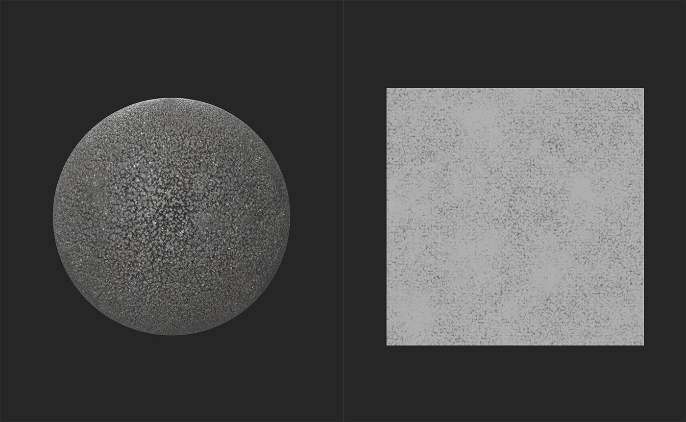
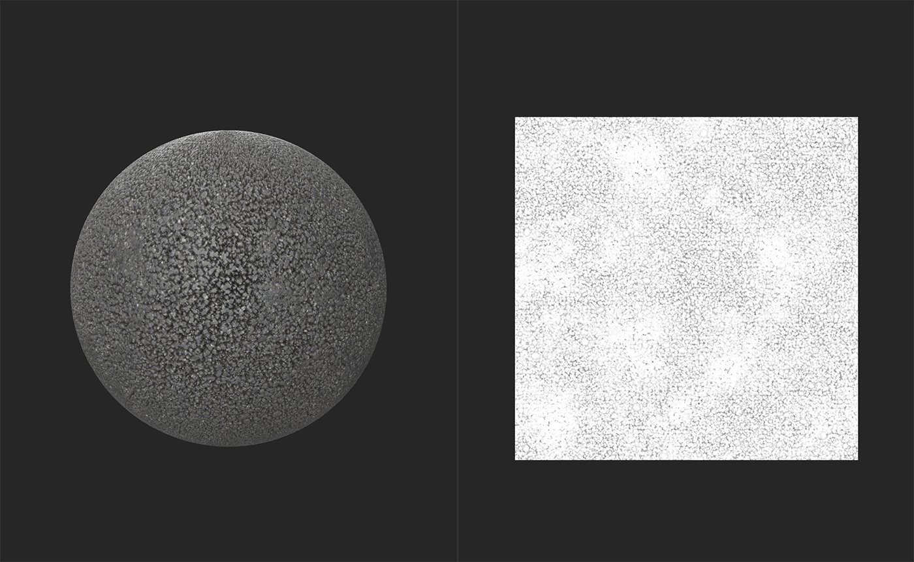

# Height to AO

<table>
<tr style="border: 0;">
<td width="41.60%" style="border: 0;" valign="top">

**In:** Tools

</td>
<td width="58.30%" style="border: 0;" valign="top">

## Description

Generate an Ambient Occlusion map from height and normal data.

See the results of the **Height to AO filter** in the images below.

In the image above, the **2D view** displays the height map. The material doesn't include any Ambient Occlusion information in this image.

In this image, the Ambient Occlusion map has been created by the **Height to AO filter** and is visible in the **2D view**. Ambient Occlusion is generally a subtle effect, so it isn't very easy to see in this material - try using the **Height to AO filter** on your materials to boost the AO intensity and get a feel for working with Ambient Occlusion.

</td>
</tr>
</table>

## Parameters

**Basic parameters**

* **Mode**:  
  Select whether to generate data from the height channel, normal channel, or both channels together.
* **Ambient Occlusion - Intensity**: 0-1  
  Adjust the strength of the generated AO data
* **Ambient Occlusion - Spread**: 0-1  
  Adjust the radius of the generated AO data
