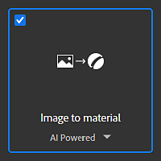
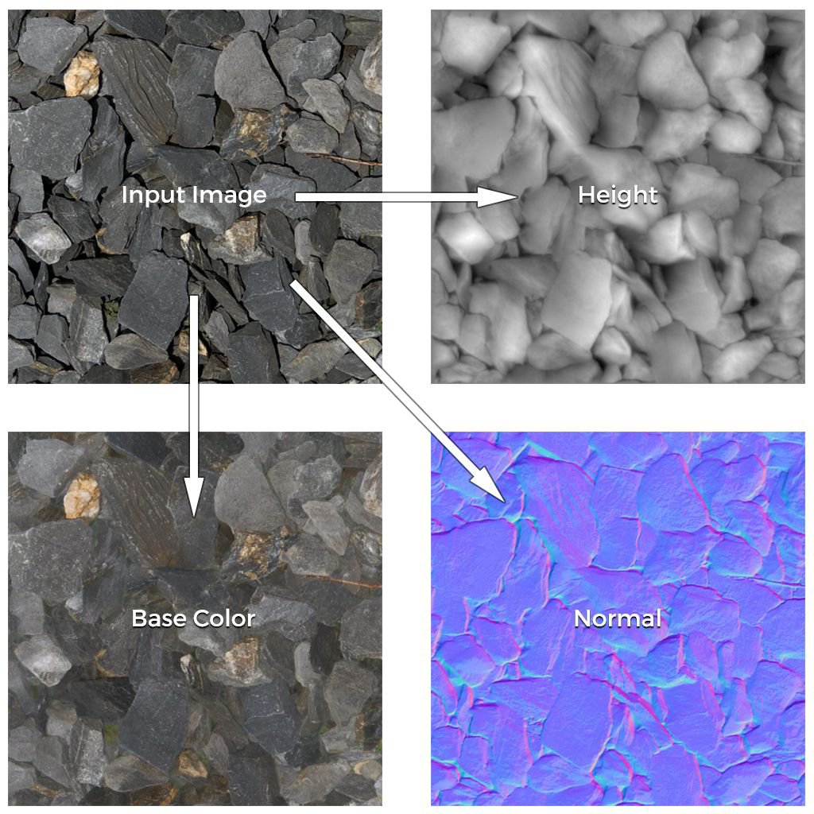
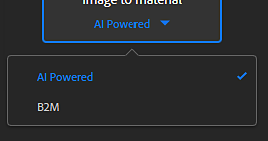
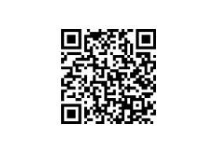

# Image To Material

The **Image to Material** template allows to generate a high-quality PBR material from a single input image.

This template has two main algorithms:

* **AI Powered**
* **B2M**

See below for a detailed explanation of each algorithm.

## Example

Here is an example of material channels generated from a single input image:

{width="500px"}

## Algorithms

To change the algorithm of the **Image to Material** template, click on the dropdown below the template name:

### AI Powered

The <b>AI Powered</b> algorithm uses machine learning to recognize shapes and objects and accurately generate, Normal, Height and Roughness maps, as well as to get rid of the albedo from any shadows or highlights.

The neural network has been trained on a wide range of materials like fabrics, organics, indoors and outdoor surfaces.

>[!NOTE]
>
> Image to Material (AI Powered) will take longer to compute on high resolution images, we recommend to use the [Layer Resolution](../../../help/interface/preferences/layer-resolution/layer-resolution.md) system to optimize your workflow while working.

### B2M

The **B2M** algorithm uses the Substance based Bitmap to Material method to generate multiple channels such as base color, normal, metallic, roughness, and ambient occlusion using procedural techniques.

This algorithm may produce less accurate results but will work on a wider range of input images.

## Adobe Capture

This functionnality is also available on Adobe Capture mobile app (Android and iOS). You can snap a photo on the go and get a preview of the result directly on your phone.

Easily send the results to Substance 3D Sampler for further editions.

>[!NOTE]
>
> This functionnality is only available with an Adobe Substance 3D Collection subscription.
