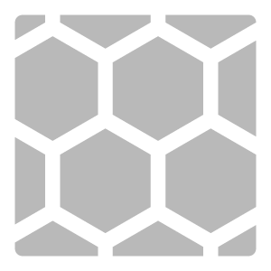
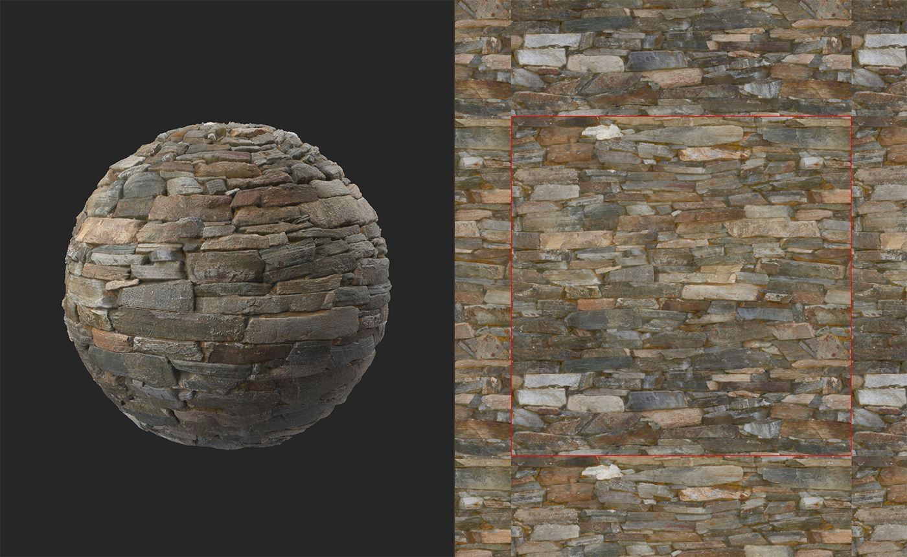
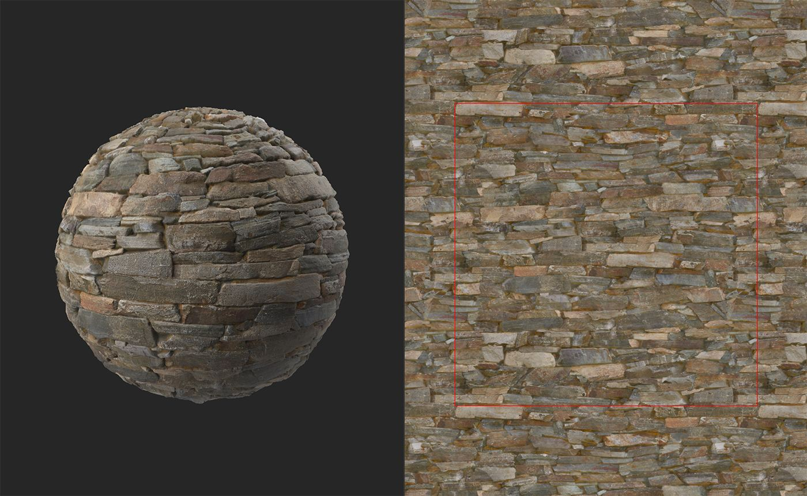
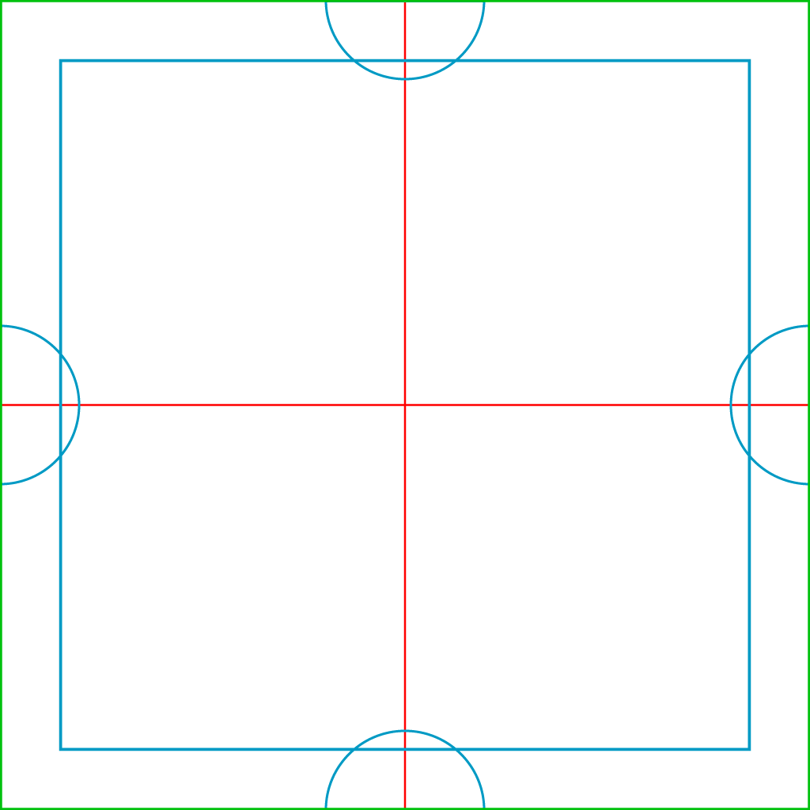

# Make it Tile

<table>
<tr style="border: 0;">
<td width="41.60%" style="border: 0;" valign="top">

**In:** Generators

</td>
<td width="58.30%" style="border: 0;" valign="top">

## Description

Use the **Make it Tile filter** to make your material tileable. The **Tiling filter** also makes your material tileable, but each filter works in a different way. If you find that the **Make it Tile filter** isn't working for you, try the **Tiling filter**.

In the images below, you can see how the **Make it Tile filter** can convert a non-tiling material into a tileable material. This material tiles well because it follows a grid-like pattern and there aren't specific points that draw focus.

In the image above, the red line shows the boundary of the material. It is quite clear that there is a strong seam, and that this material doesn't tile.

After **Make it Tile**, this material tiles well and without the red line, it would be impossible to see seams at the boundaries of the material.

</td>
</tr>
</table>

## Parameters

**Basic parameters**

* **Threshold**: 0-1  
  Adjust the size and matching of the top layer.
* **Smoothness**: 0-1  
  Smooth the seam of the top layer.
* **Contrast**: 0-1  
  Adjust the contrast of the seam. Decreasing the contrast has the same effect as blurring the seam.
* **Spots Removal**: toggle  
  If enabled, the filter will try to remove artifacts near the seam between the top and bottom layers.
* **Color Equalizer**: 0-50  
  Equalize color values to decrease the visibility of the seam.
* **Height Matching**:   
  Change how the height maps are blended for the top and bottom layer of the filter. To see results more clearly, view the height channel in the **2D view**. Note that height matching does not impact channels other than the height channel, so the normals and AO will not be affected by changes to height matching.

**Advanced Parameters**

* **Chrominance Influence**: 0-1  
  Adjust how much color values affect the seam.
* **Mask Invert**: toggle  
  Invert the top and bottom layers masks.
* **Height Matching Smoothness**: 0-16  
  Adjust the blur of height matching between the top and bottom layers.
* **Left/Right Patch Source**: -1 to 1  
  Adjust the source location for the left and right patches.
* **Top/Bottom Patch Source**: -1 to 1  
  Adjust the source location for the top and bottom patches.

## Usage Guide

The **Make it Tile** **filter** works by overlaying multiple copies of the material on top of one another.

The image below shows the layout of the layers:

* The green perimeter shows the edges of the resulting material from the **Make it Tile filter**
* The red lines show the borders of the bottom layer. The bottom layer is offset by 50% of the UV space on the X and Y axes, so the red lines are tiling seams that need to be covered.
* The blue square and semi-circles are cover the red seams. The filter's parameters allow you to adjust the borders of the blue shapes to ensure that the red seam isn't visible while keeping the blue seam as smooth as possible.

{width="512px"}

The left and right semi-circles match each other to ensure the material tiles horizontally, and the top and bottom semi-circles ensure the material tiles vertically. The blue square in the center removes hides all the remaining seams to create a fully tileable material with no seams.
