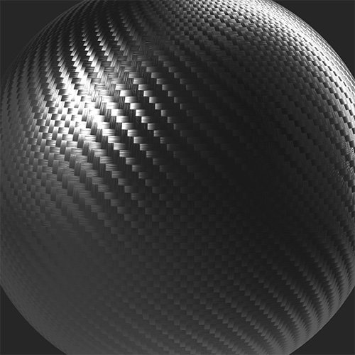
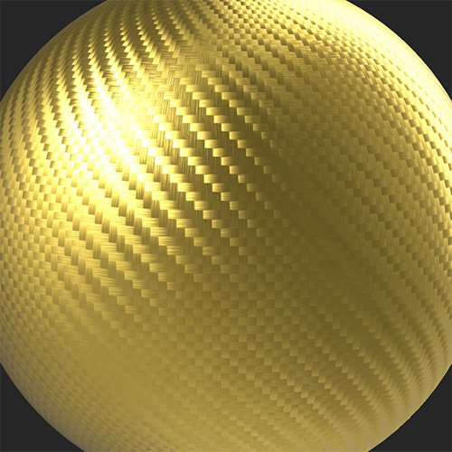

# Match

<table>
<tr style="border: 0;">
<td width="41.60%" style="border: 0;" valign="top">

**In:** Tools

</td>
<td width="58.30%" style="border: 0;" valign="top">

## Description

The **Match filter** allows you to to match the color and roughness of your material with chosen parameters or another material.

The images below show the **Match filter** being used to convert a carbon fiber material into patterned gold by adjusting the base color.

<table>
<tr style="border: 0;">
<td style="border: 0;" valign="top">

{width="200px"}

</td>
<td style="border: 0;" valign="top">

{width="200px"}

</td>
</tr>
</table>

</td>
</tr>
</table>

## Parameters

**Basic parameters**

* **Target Mode**:  
  Choose whether to match with an input material or custom parameters. Available parameters depend on which **Target Mode** is selected.
  * **Input** 
    * **Radius**: 0-50  
      Adjust the radius of the matched area
    * **Presets**:  
      Select whether to match just color, or both color and roughness. This selection changes what options are available in **Advanced Parameters**
  * **Parameter**
    * **Presets**:  
      Select whether to match just color, or both color and roughness. This selection changes what options are available in **Advanced Parameters**
    * **Base Color**: color select  
      Select the color to match
    * **Roughness**: 0-1  
      Set the roughness to match

**Advanced Parameters**

* **Input Tiled**: toggle  
  Enable this if the input tiles to improve the match at the edges of the material
* **Basecolor - Match Target**: 0-1  
  Adjust the strength of the basecolor matching
* **Roughness - Match Target**: 0-1  
  Adjust the strength of the roughness matching
