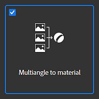
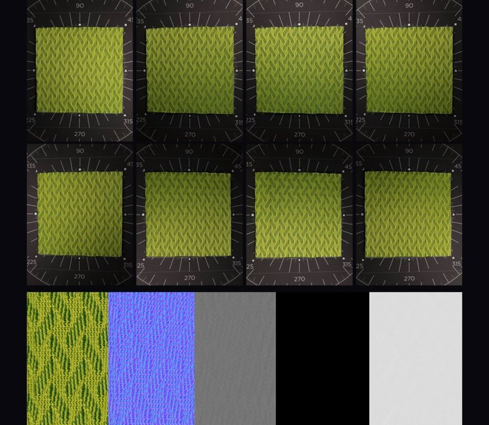
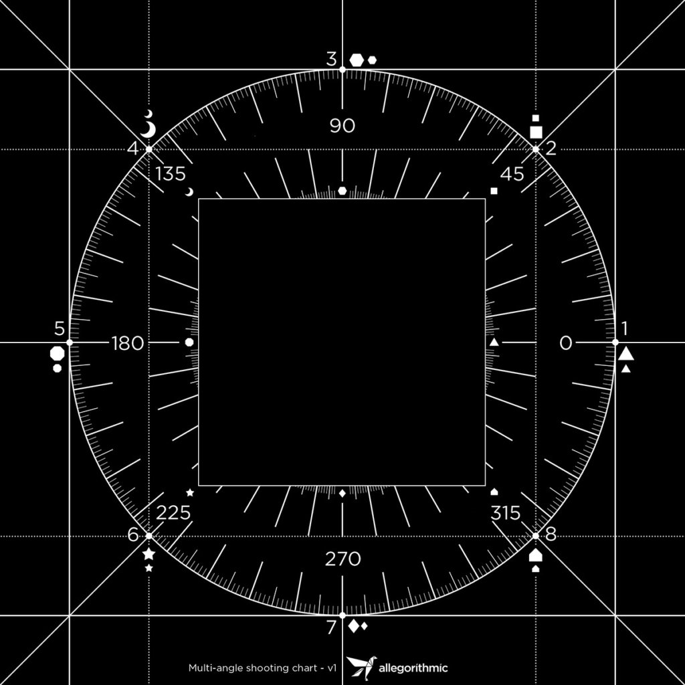
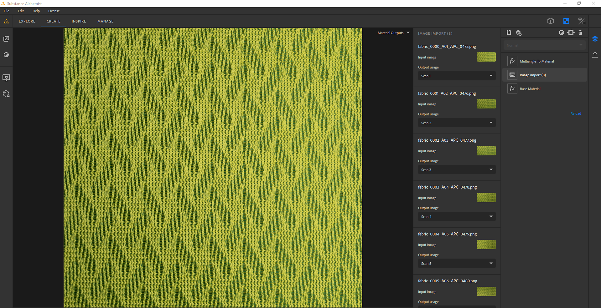
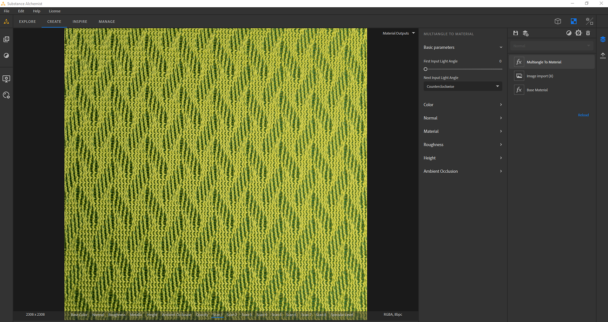

# Multiangle To Material

The **Multiangle to Material** template creates a material from 2 to 8 input images taken under specific light conditions. Such light conditions can be achieved with a material scanner.

>[!NOTE]
>
> You can find more information on how to create your own material scanner [in this article](https://www.adobe.com/products/substance3d/magazine/your-smartphone-is-a-material-scanner-vol-ii.html).

## Example

Here is an example of a material created from 8 input images:

* The first 8 images are the scan images taken under 8 light angles.
* The bottom images are the outputs of the template (base color, normal, height, metallic, and roughness).

{width="400px"}

## Substance 3D Sampler Configuration

There are 3 things to set and configure to be sure the PBR channels will be extracted correctly:

* Order of your scan images
* The first input light angle
* the next input light angle

{width="450px"}

### Order of you scan images

When importing your images, verify in the Image Import Layer, that the 8 images are consecutive.

For example, the first image at 0° should be **scan1** then the image at 45° should be **scan2** ... then the image at 315° should be **scan8**

{width="450px"}

### First and Next light angle

In the Multiangle to Material layer:

* Set First Input Light Angle. If your **scan1** is at 180°, the first input light angle =0.5 or if your **scan1** is at 0°, the first input light angle = 0
* Set Next Input Light Angle: It defines the direction of the rotation of your image. If scan1 is 0°, scan2 45°... the value is **Counterclockwise**

{width="450px"}
