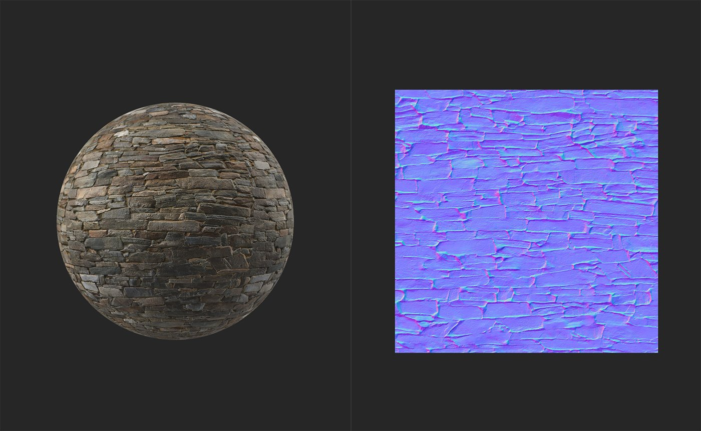

# Normal to Height

<table>
<tr style="border: 0;">
<td width="41.60%" style="border: 0;" valign="top">

**In:** Tools

</td>
<td width="58.30%" style="border: 0;" valign="top">

## Description

Generate height information based on the normal channel.

The images below show the **Normal to Height filter** in action. In the first image, the height map has no height information. In the second image, after the **Normal to Height** **filter** has been applied, a realistic height map is generated.

</td>
</tr>
</table>

## Parameters

This filter has no parameters. To use it, simply add it to the top of your layer stack.

 