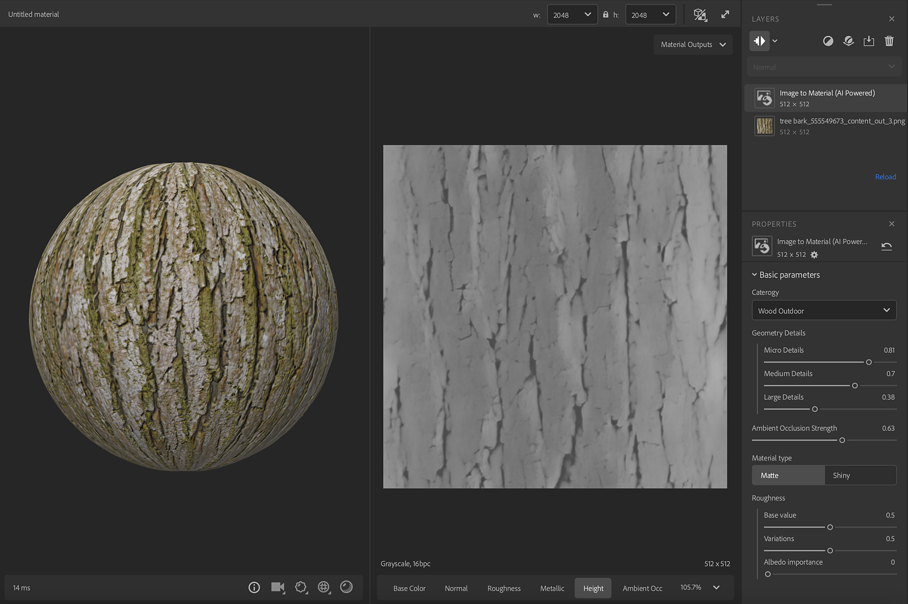
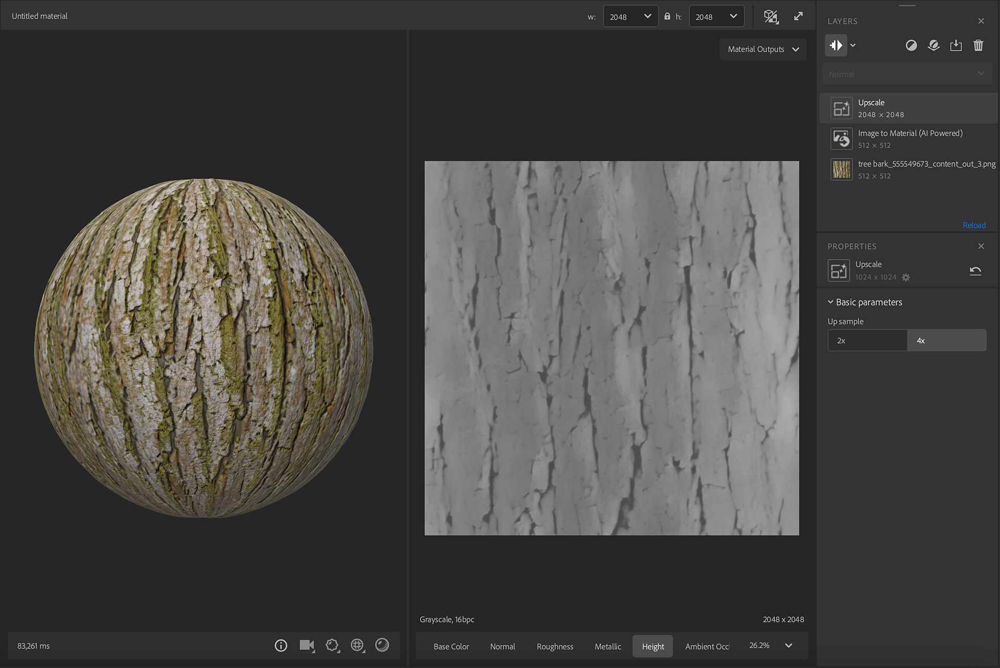

# Upscale

<table>
<tr style="border: 0;">
<td style="border: 0;" valign="top">

**In:** Tools

</td>
<td style="border: 0;" valign="top">

## Description

The <b>Upscale </b>filter uses AI to upsample the PBR channels (BaseColor, Roughness, Normal, Metallic, Height) from the layers below it.

<table>
<tr style="border: 0;">
<td style="border: 0;" valign="top">

</td>
<td style="border: 0;" valign="top">

</td>
</tr>
</table>

In this exemple we start with a 1024x1024px image but the output result is in 4098x4098px. The results using the <b>Upscale</b> filter are more defined.

</td>
<td style="border: 0;" valign="top">

>[!NOTE]
>
> **Advanced filter**
> 
> The <b>Upscale</b> is an advance filter.   
> To use it at it's maximum capacity and avoiding blurry results, we recommend to set the layers below the <b>Upscale</b> in Layer Input Max or Layer Input Min.
> 
> There are no limits on how many <b>Upscale </b>filters can be used, but upsampling above 8k resolution might significantly impact performance.

</td>
</tr>
</table>

## Parameters

<b>Basic parameters</b>

* <b>Up sample</b>: Toggle button group  
  Choose the multiplication factor to upscale

## How to

In the image above, a low resolution image is processed by the [Image to Material (AI Powered)](../../../help/guide/filters/tools/image-to-material/image-to-material.md).

The <b>Upscale</b> filter is added to up sample the results. It halucinate details in order to reach a higher resolution keeping the quality of the material. You can chose in the properties to upsample by 2 or by 4.
