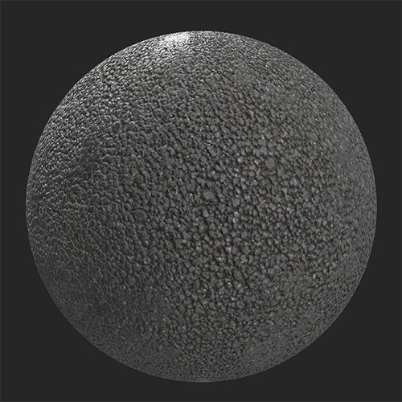
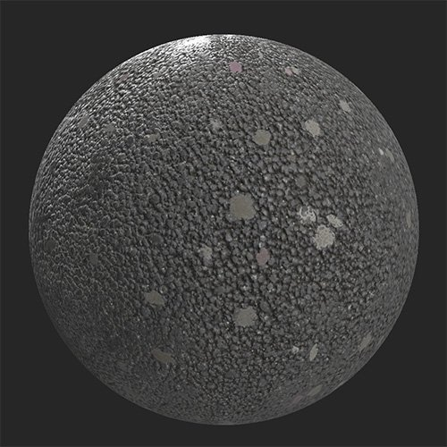

# Discarded Gums

<table>
<tr style="border: 0;">
<td width="41.60%" style="border: 0;" valign="top">

**In:** Wear and Finish

</td>
<td width="58.30%" style="border: 0;" valign="top">

## Description

Add discarded chewing gum to your material. This filter is great for creating pavements or other materials for public walking areas.Before and after using the **Discarded Gums** filter on an asphalt material.

<table>
<tr style="border: 0;">
<td style="border: 0;" valign="top">

{width="200px"}

</td>
<td style="border: 0;" valign="top">

{width="200px"}

</td>
</tr>
</table>

</td>
</tr>
</table>

## Parameters

**Basic parameters**

* **Random Seed**:  
  The random seed determines the random values of other parameters that use randomness in this filter.
* **Gum Density**: 0-1  
  Adjust how many spots appear.
* **Gum Size**: 0-1  
  Adjust the scale of the spots.
* **Gum Color 1**: color select.  
  Modify the color of the spots.
* **Gum Color 2**: color select  
  Modify the color of the spots.
* **Gum Color Distribution Balance**: 0-1  
  Adjust the relative frequency of each color's appearance.
* **Gum Aging**: 0-1  
  Change the appearance of spots to make them appear older or younger. When this value is set to 0, the **Gum Aging Variation** slider will disappear.
* **Gum Aging Variation**: 0-1  
  Randomly vary the age of spots
* **Gum Aging Darkening**: 0-1  
  Adjust how much the spots are darkened due to age.
* **Gum Dirt**: 0-1  
  Control how dirty the spots appear.
* **Gum Dirt Color**: color select  
  Select the color of the dirt overlaid on the spots.
* **Gum Dirt Variation**:   
  Adjust how much the dirt varies across spots.
* **Custom Mask**: toggle  
  Enable or disable the use of a custom mask. The following control will appear if **Custom Mask** is enabled:  
  * **Mask**: image/brush  
    Select an image to use as a mask or use the brush to paint a custom mask directly in the 2D view.

**Advanced Parameters**

* **Gum Height Range**: 0-1  
  Control how far the spots extend above the underlying surface.
* **Gum Normal Intensity**: 0-1  
  Adjust the strength of the normal impact due to the spots.

 