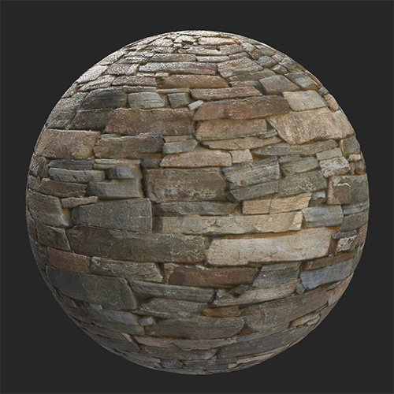
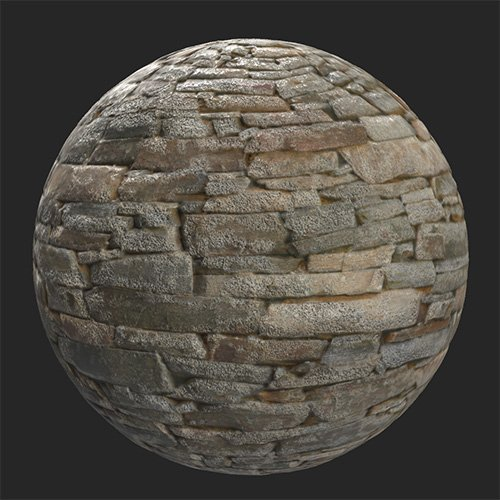

# Erode

<table>
<tr style="border: 0;">
<td width="41.60%" style="border: 0;" valign="top">

**In:** Wear and Finish

</td>
<td width="58.30%" style="border: 0;" valign="top">

## Description

Use the **Erode filter** to wear away at high spots on your material.

The images below show how the **Erode filter** can be used to add erosion to a stone wall.

<table>
<tr style="border: 0;">
<td style="border: 0;" valign="top">

{width="200px"}

</td>
<td style="border: 0;" valign="top">

{width="200px"}

</td>
</tr>
</table>

</td>
</tr>
</table>

## Parameters

**Basic parameters**

* **Random Seed**:  
  The random seed determines the random values of other parameters that use randomness in this filter.
* **Erosion Color**: color select  
  Set the color of the eroded areas.
* **Grooves Dust Color**: color select  
  Set the color of the dust.
* **Quartz Color**: color select  
  Set the color of the Quartz revealed by the erosion.
* **Erosion Area Size**: 0-1  
  Modify how widespread the erosion effect is.
* **Erosion Roughness**: 0-0.63  
  Change the roughness of the material as a result of the erosion.
* **Erosion Intensity**: 0-1  
  Adjust the strength of the erosion effect.
* **Rain Effect Intensity**: 0-1
* **Grooves**: 0-1
* **Grooves Dust Intensity**: 0-1
* **Grooves Scratches Intensity**: 0-1  
  Adjust the impact of the grooves on the normals and height maps.
* **Micro Grain Density**: 0-1  
  Adjust the density of the groove scratches.
* **Quartz Intensity**: 0-1  
  Adjust the visibility of the quartz areas.
* **Quartz Roughness**: 0-1  
  Adjust the roughness of the quartz.
* **Quartz Normal Variation**: 0-1  
  Modify the normals of quartz areas.
* **Use Custom Mask**: toggle  
  Enable or disable the use of a custom mask. If enabled the following parameters appear:
  * **Mask**: image/brush  
    Select an image to use as a mask or use the brush to paint a custom mask directly in the 2D view.
  * **Custom Mask - Blur**: 0-1  
    Blur the mask.
  * **Custom Mask - Invert**: toggle  
    Invert the mask.
  * **Custom Mask - Opacity**: 0-1  
    Adjust the strength of the custom mask.
