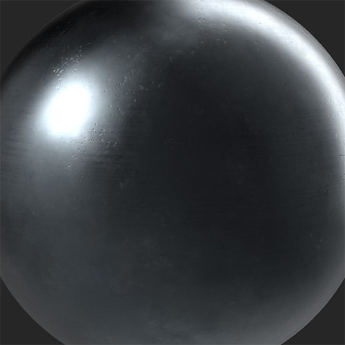
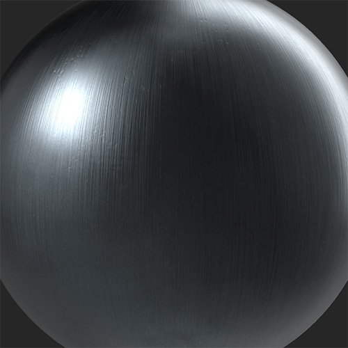

# Metal Finish

<table>
<tr style="border: 0;">
<td width="41.60%" style="border: 0;" valign="top">

**In:** Wear and Finish

</td>
<td width="58.30%" style="border: 0;" valign="top">

## Description

Convert your material into a metal with a number of finishes and styles.

*A raw metal material is converted into a brushed metal surface with the **Metal Finish filter.***

<table>
<tr style="border: 0;">
<td style="border: 0;" valign="top">

{width="200px"}

</td>
<td style="border: 0;" valign="top">

{width="200px"}

</td>
</tr>
</table>

</td>
</tr>
</table>

## Parameters

**Basic parameters**

* **Random Seed**:  
  The random seed determines the random values of other parameters that use randomness in this filter.
* **Modify Only Metallic**: toggle  
  When enabled, this filter will limit it's changes to the metallic channel.
* **Metal Color Mode**:   
  Select a color based on an existing metal or choose your own. With **Custom Color** selected, the following control will appear:
  * **Metal Color**: color select  
    Select a custom color for your metal finish.
* **Finish Type**:   
  Select a style to apply to your metal. Each style has different parameters that allow you to adjust it's appearance. The following parameters can appear:
  * **Intensity**: 0-1  
    Adjust the intensity of the chosen finish.
  * **Scale**: 0-1  
    Modify the scale of the pattern driving the chosen finish.
  * **Roughness**: 0-1  
    Control the roughness value of the metal.
  * **Beads Scale**: 0-1  
    Available for **Sandblasted**. Set the size of the beads used to create the sandblasting effect.
  * **Polished**: 0-1  
    Available for **Cast**. Adjust the amount of polishing which smooths away higher parts of the material.
  * **Pattern**:  
    Available for **Grinded**. Set the pattern used by the grinder.
  * **Relief Details**: 0-1  
    Available for **Raw**. Adjust the normal strength.
  * **Orientation**: 0-1  
    Available for **Brushed**. Change the direction of the brush effect.
  * **Brush Length**: 0-1  
    Available for **Brushed**. Change the length of the strokes used to create the brush effect.
  * **Brushed**: 0-1  
    Available for **Galvanized**. Overlay a brushed appearance on the galvanized finish.

**Mask**

* **Use Custom Mask**: toggle  
  Enable or disable the use of a custom mask. If enabled the following parameters appear:
  * **Mask**: image/brush  
    Select an image to use as a mask or use the brush to paint a custom mask directly in the 2D view.
  * **Custom Mask - Blur**: 0-1  
    Blur the mask.
  * **Custom Mask - Invert**: toggle  
    Invert the mask.

**Advanced Parameters**

* **Base Color**: toggle  
  Set whether the base color channel is affected by the filter.
* **Metallic**: toggle  
  Set whether the metallic channel is affected by the filter.
* **Roughness**: toggle  
  Set whether the roughness channel is affected by the filter.
* **Specular Level**: toggle  
  Control whether the specular level channel is affected by the filter. If enabled, an additional control appears:
  * **Specular Level** **- Value**: 0-1  
    Adjust the value for the specular channel.

>[!NOTE]
>
> There is currently a known bug where the **Specular Level** control can disappear if disabled with no control to re-enable it. If you lose the **Specular Level** control but need it back, you can use undo (ctrl + z or cmd + z on macOS) to undo disabling the toggle.

* **Normal**: toggle  
  Set whether the normal channel is affected by the filter. If enabled, an additional control appears:  
  * **Normal Intensity**: 0-1  
    Adjust the strength of the normal modification by the filter.
* **Height**: toggle  
  Set whether the height channel is affected by the filter.
* **Emissive**: toggle  
  Set whether the emissive channel is affected by the filter. If enabled, an additional control appears:  
  * **Emissive - Color**: color select  
    Set the color of the emissive channel.
* **Ambient Occlusion**: toggle  
  Set whether the ambient occlusion channel is affected by the filter. If enabled, the following additional controls appear:
  * **Ambient Occlusion - Intensity**: 0-1  
    Adjust the strength of the generated AO.
  * **Ambient Occlusion** **- Radius**: 0-1  
    Adjust the radius of the AO effect.
* **Opacity**: toggle  
  Set whether the opacity channel is affected by the filter. If enabled, an additional control appears:  
  * **Opacity - Value**: 0-1  
    Change the opacity of the material.
