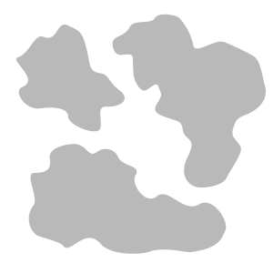
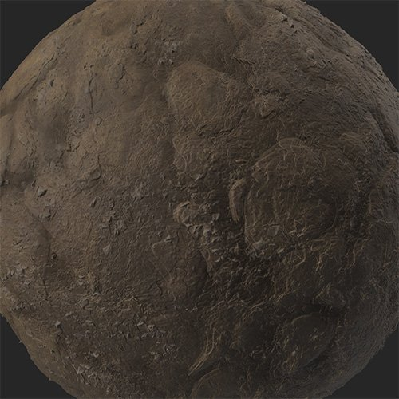
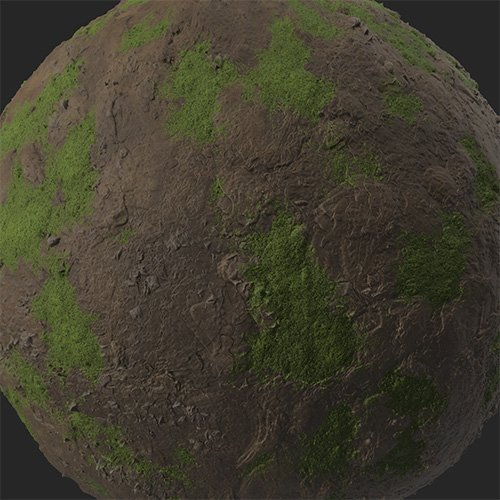

# Moss

<table>
<tr style="border: 0;">
<td width="41.60%" style="border: 0;" valign="top">

**In:** Wear and Finish

</td>
<td width="58.30%" style="border: 0;" valign="top">

## Description

Use the **Moss filter** to add moss and lichen to your material. **Moss** uses the occlusion map of your material to grow naturally in cracks and crevices.

The images below show the dirt material before and after having the **Moss filter** applied.

<table>
<tr style="border: 0;">
<td style="border: 0;" valign="top">

{width="200px"}

</td>
<td style="border: 0;" valign="top">

{width="200px"}

</td>
</tr>
</table>

</td>
</tr>
</table>

## Parameters

**Basic parameters**

* **Random Seed**:  
  The random seed that all other random parameters in this filter is based on.
* **Moss Global Spread**: 0-1  
  Adjust the coverage of the moss on your material.
* **Moss Color**: color select  
  Select the primary color of the moss.
* **Secondary Moss Color**: color select  
  Select the secondary color of the moss.
* **Moss Repartition**:   
  Select the method used to apply the moss. By default **Occlusion** uses the AO map of your material to apply the moss, but the other options will have different effects. If **Custom** **Mask** is selected, the **Mask** **section** will appear.

**Mask**

This section only appears if **Custom Mask** is chosen under **Basic parameters &gt; Moss Repartition**.

* **Custom Mask - Blur**: 0-1  
  Blur the mask.
* **Custom Mask - Invert**: toggle  
  Invert the mask.
* **Custom Mask**: image/brush  
  Select an image to use as a mask or use the brush to paint a custom mask directly in the 2D view.

**Moss**

Available parameters under this section depend which option is selected under **Basic parameters &gt; Moss Repartition**.

* **Occlusion**
  * **Moss Occlusion Propagation**: 0-1  
    Control the spread of the moss based on occlusion.
  * **Moss Occlusion Mask**: 0-1  
    Adjust the amount of moss using the occlusion map as a mask.
* **Overall**
  * **Moss Overall Propagation**: 0-1  
    Adjust the amount of moss to appear.
* **Top**  
  * **Top Moss Threshold**: 0-1  
    Control the threshold that determines whether or not moss appears.
  * **Top Moss Angle**Adjust how the moss applies to the material based on the normal map.
* **All**
  * **All** includes all of the parameters above for **Occlusion**, **Overall**, and **Top**.

The following parameters are available independently of which option is selected under **Basic parameters &gt; Moss Repartition**.

* **Moss Flowers Size**: 0-1  
  Change granularity of the moss.
* **Moss Grain Intensity**: 0-1  
  Adjust how visible the grain of the Moss is.
* **Moss Clumps Size**: 0-1  
  Control the tendency of the moss to clump together.
* **Moss Clumps Sharpness**: 0-1  
  Adjust how soft the edges of the clumps appear.
* **Moss Clumps Intensity**: 0-1  
  Control the intensity of the clumps of moss.
* **Moss Feather**: 0-1  
  Adjust how the edges of the moss mask are feathered.
* **Moss Bump Intensity**: 0-1  
  Change the bumpiness of the moss.
* **Top Moss Threshold**: 0-1

**Technical Parameters**

* **Normal Intensity**: 0-1  
  Adjust the strength of the moss normals.
* **Ambient Occlusion Intensity**Control the strength of the moss' ambient occlusion.
