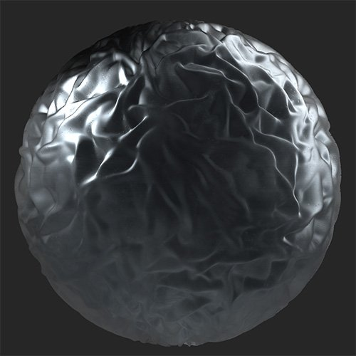
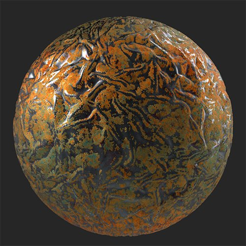

# Oxidate

<table>
<tr style="border: 0;">
<td width="41.60%" style="border: 0;" valign="top">

**In:** Wear and Finish

</td>
<td width="58.30%" style="border: 0;" valign="top">

## Description

Add a layer of oxidation over the top of your material.*A wrinkled surface has the **Oxidate filter** applied.*

<table>
<tr style="border: 0;">
<td style="border: 0;" valign="top">

{width="200px"}

</td>
<td style="border: 0;" valign="top">

{width="200px"}

</td>
</tr>
</table>

</td>
</tr>
</table>

## Parameters

**Basic parameters**

* **Random Seed**:  
  The random seed determines the random values of other parameters that use randomness in this filter.
* **Target Areas**: toggle  
  Enable to change how the oxidization effect is applied across the material. When enabled, the following control will appear:
  * **Target Areas Strength**: 0-1  
    Adjust the spread of the target areas effect.
  * **Spreading**: 0-1  
    Adjust how far the oxidizing spreads.
* **Color**: color select  
  Select the base color of the filter. The base colors modifies the hue of all the colors that make up the oxidizing effect.
* **Color Variations**: 0-1  
  Adjust the scale of the color variation effect.
* **Density**: 0-1  
  Change the coverage density of the effect.
* **Edge Bleed**: 0-1  
  Modify how the edges of the oxidization effect bleed into non-oxidized areas.
* **Patches**: 0-1  
  This is a separate control to modify the mask between oxidized and non-oxidized areas. Combine it with the density and other controls to fine tune the edges of the oxidized areas.
* **Chipping**: 0-1  
  Chip away at the oxidized area to reveal the underlying material.
* **Stains**: 0-1  
  Adjust the amount of staining overlaid on top of the material.
* **Corrosion Roughness**: 0-1  
  Adjust the roughness of the oxidized areas.
* **Corrosion Metallic**: 0-1  
  Adjust the metallic values of the oxidized areas.
* **Noise Strength**: 0-1

**Mask**

* **Use Custom Mask**: toggle  
  Enable or disable the use of a custom mask. If enabled the following parameters appear:
  * **Mask**: image/brush  
    Select an image to use as a mask or use the brush to paint a custom mask directly in the 2D view.
  * **Custom Mask - Blur**: 0-1  
    Blur the mask.
  * **Custom Mask - Invert**: toggle  
    Invert the mask.
  * **Custom Mask Opacity**: 0-1  
    Adjust the opacity of the mask.

**Technical Parameters**

The following parameters allow you to adjust the named value for the whole material without adding an adjustment layer such as **Brightness/Contrast** or **Hue/Saturation**

* **Luminosity**: 0-1
* **Contrast**: -1 to 1
* **Hue Shift**: 0-1
* **Saturation**: 0-1
* **Normal Intensity**: 0-1
* **Height Range**: 0-1
* **Height Position**: 0-1
* **Ambient Occlusion Intensity**: 0-1
