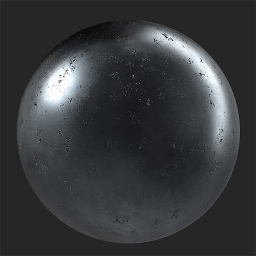
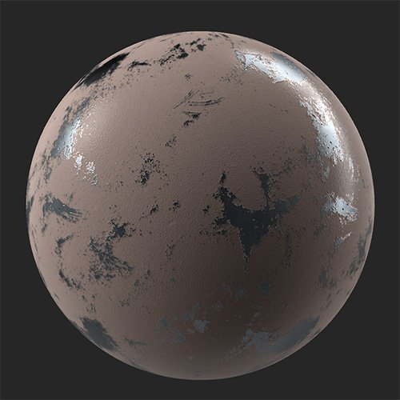

# Paint

<table>
<tr style="border: 0;">
<td width="41.60%" style="border: 0;" valign="top">

**In:** Wear and Finish

</td>
<td width="58.30%" style="border: 0;" valign="top">

## Description

The **Paint filter** lets you cover your material in a layer of paint of varying thickness.

*A metal material with worn paint added on top of it.*

<table>
<tr style="border: 0;">
<td style="border: 0;" valign="top">

{width="200px"}

</td>
<td style="border: 0;" valign="top">

{width="200px"}

</td>
</tr>
</table>

</td>
</tr>
</table>

## Parameters

**Basic parameters**

* **Random Seed**:  
  The random seed determines the random values of other parameters that use randomness in this filter.
* **Color**: color select  
  Set the paint color.
* **Roughness**: 0-1  
  Set the roughness of areas that the paint covers.
* **Thickness**: 0-1  
  Adjust the viscosity and thickness of the paint. This impacts how much of the underlying height and normal information is visible through the paint.
* **Peel**: 0-1  
  Add patches where the paint has peeled away from the underlying material.
* **Grain**: 0-1  
  Change the grain of the surface of the paint.
* **Grain Size**: 1-5  
  Adjust the scale of the texture used to create the grains.

**Mask**

* **Cavity Mask**: toggle  
  Create a mask based on the cavities found in the height map. If enabled the following parameters appear:
  * **Cavity Size**: 0-1  
    Adjust the height range used to create the cavity mask.
  * **Cavity Intensity**: 0-1  
    Adjust the opacity of the mask based on cavity depth.
  * **Cavity Invert Mask**: toggle  
    Invert the cavity mask to change whether it affects high or low points.
* **Use Custom Mask**: toggle  
  Enable or disable the use of a custom mask. If enabled the following parameters appear:
  * **Mask**: image/brush  
    Select an image to use as a mask or use the brush to paint a custom mask directly in the 2D view.
  * **Custom Mask - Blur**: 0-1  
    Blur the mask.
  * **Custom Mask - Invert**: toggle  
    Invert the mask.

**Advanced Parameters**

* **Base Color**: toggle  
  Set whether the base color channel is affected by the filter.
* **Metallic**: toggle  
  Set whether the metallic channel is affected by the filter.
  * **Metallic Value**: 0-1  
    Adjust metallic value of the painted areas.
* **Roughness**: toggle  
  Set whether the roughness channel is affected by the filter.
* **Normal**: toggle  
  Set whether the normal channel is affected by the filter. If enabled, an additional control appears:
  * **Normal - Intensity**: -1 to 1  
    Adjust the intensity of the normals.
* **Height**: toggle  
  Set whether the height channel is affected by the filter. If enabled, an additional control appears:
  * **Height - Intensity**: 0-1  
    Adjust the contrast of the height map.
* **Opacity**: toggle  
  Set whether the opacity channel is affected by the filter. If enabled, an additional control appears:  
  * **Opacity - Value**: 0-1  
    Change the opacity of the material.
* **Emissive**: toggle  
  Set whether the emissive channel is affected by the filter. If enabled, an additional control appears:  
  * **Emissive - Color**: color select  
    Set the color of the emissive channel.
* **Ambient Occlusion**: toggle  
  Set whether the ambient occlusion channel is affected by the filter. If enabled, the following additional controls appear:
  * **Ambient Occlusion - Intensity**: 0-1  
    Adjust the strength of the generated AO.
  * **Ambient Occlusion** **- Radius**: 0-1  
    Adjust the radius of the AO effect.
