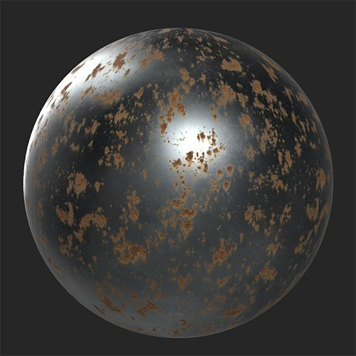

# Rust

<table>
<tr style="border: 0;">
<td width="41.60%" style="border: 0;" valign="top">

**In:** Wear and Finish

</td>
<td width="58.30%" style="border: 0;" valign="top">

## Description

Use the **Rust filter** to add a layer of oxidized metal to your material.

In the images below you can see a metal material before and after adding the **Rust filter**.

{width="200px"}

</td>
</tr>
</table>

## Parameters

**Basic parameters**

* **Random Seed**:  
  The random seed determines the random values of other parameters that use randomness in this filter.
* **Rust Spread**: 0-1  
  Control the spread or amount of rust.
* **Edge Influence**: 0-1  
  Adjust how rust interacts with edges based on the curvature map.
* **Spread Smoothness**: 0-1  
  Increase this to make the rusted areas more blobby or decrease it to make them more detailed.
* **Affect Metal Only**: toggle  
  When enabled, the **Rust filter** will only impact areas that have a metallic value greater than 0.

**Rust**

* **Rust Shape**:  
  Change the pattern on which the rust is based.
* **Rust Intensity**: 0-1  
  Modify the strength of the rust effect. Increasing this value makes the rust appear older and stronger.

**Peel**

* **Peel Scale**: 0-1  
  Change the scale of the peeling rust.
* **Peel Normal Intensity**: 0-1  
  Adjust the visibility of the peel's normals.
* **Peel Height Intensity**: 0-1  
  Adjust the impact of the peels on the height map.

**Drips**

* **Drips Intensity**: 0-1  
  Change the strength of the drip effect.
* **Drips Orientation**: 0-1  
  Orient the drips to match gravity or wind.
* **Drips Length**: 0-1  
  Adjust how far the drips extend from the source.

**Mask**

* **Use Mask**: toggle  
  Enable or disable the use of a custom mask. If enabled the following parameters appear:
  * **Mask**: image/brush  
    Select an image to use as a mask or use the brush to paint a custom mask directly in the 2D view.
  * **Custom Mask - Blur**: 0-1  
    Blur the mask.
  * **Custom Mask - Invert**: toggle  
    Invert the mask.
