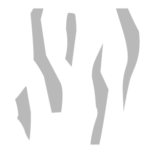
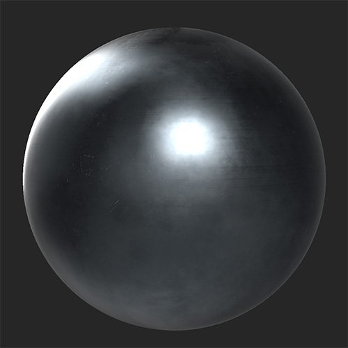
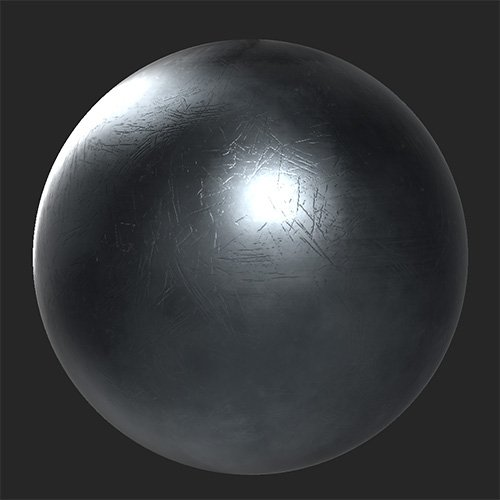

# Scratch

<table>
<tr style="border: 0;">
<td width="41.60%" style="border: 0;" valign="top">

**In:** Wear and Finish

</td>
<td width="58.30%" style="border: 0;" valign="top">

## Description

Add scratches and wear to your material.

*Before and after applying the **Scratch filter**.*

<table>
<tr style="border: 0;">
<td style="border: 0;" valign="top">

{width="200px"}

</td>
<td style="border: 0;" valign="top">

{width="200px"}

</td>
</tr>
</table>

</td>
</tr>
</table>

## Parameters

**Basic parameters**

* **Random Seed**:  
  The random seed determines the random values of other parameters that use randomness in this filter.
* **Scratch**: toggle  
  Enable or disable scratches. If enabled the **Scratch** section appears.
* **Chip**: toggle  
  Add a chipped effect to the surface. If enabled the **Chip** section appears.
* **Micro-scratch**: toggle  
  Add micro-scratches to the surface. If enabled the **Micro-scratch** section appears.

**Scratch**

**Basic parameters &gt; Scratch** needs to be enabled for this section to appear.

* **Amount**: 0-1  
  Control the number of scratches that appear.
* **Intensity**: 0-1  
  Adjust the depth and strength of the scratches.
* **Scale**: 1-4  
  Change the size of the scratches. Increase this slider decreases the scratch size.

**Chip**

**Basic parameters &gt; Scratch** needs to be enabled for this section to appear.

* **Amount**: 0-1  
  Control the number of chips that appear.
* **Intensity**: 0-1  
  Adjust the depth and strength of the chips.
* **Scale**: 1-4  
  Change the size of the chips. Increase this slider decreases the chip size.

**Micro-scratch**

* **Amount**: 0-1  
  Control the number of micro-scratches that appear.
* **Intensity**: 0-1  
  Adjust the depth and strength of the micro-scratches.
* **Rotation**: 0-1  
  Rotate the micro-scratches.
* **Rotation Random**: 0-1  
  Vary the rotation of the micro-scratches randomly.
* **Scale**: 0-2  
  Adjust the size of the micro-scratches. Increase this slider to increase micro-scratch size.
* **Scale Random**: 0-1  
  Vary the scale of the micro-scratches randomly.
* **Width**: 0-1  
  Control the width of the scratches
* **Width Random**: 0-1  
  Vary the width of the micro-scratches randomly.
* **Distortion**: 0-1  
  Add distortion to the scratches to break up uniformity.
* **Distortion Random**: 0-1  
  Control the randomness of the distortion effect.
* **Distortion Frequency**: 0-1  
  Control the frequency scale of the distortion effect.

**Mask**

* **Custom Mask**: toggle  
  Enable or disable the use of a custom mask. If enabled the following parameters appear:
  * **Mask**: image/brush  
    Select an image to use as a mask or use the brush to paint a custom mask directly in the 2D view.
  * **Custom Mask - Blur**: 0-1  
    Blur the mask.
  * **Custom Mask - Invert**: toggle  
    Invert the mask.

**Advanced Parameters**

* **Overall Opacity**: 0-1  
  Adjust the opacity of the **Scratch filter** effect.
* **Base Color**: toggle  
  Set whether the base color channel is affected by the filter. If enabled, an additional control appears:
  * **Base Color - Color**: color select  
    Select the base color of the scratches and chips.
* **Metallic**: toggle  
  Set whether the metallic channel is affected by the filter. If enabled, an additional control appears:
  * **Metallic Value**: 0-1  
    Adjust metallic value of the scratched areas.
* **Roughness**: toggle  
  Set whether the roughness channel is affected by the filter. If enabled, an additional control appears:
  * **Roughness - Value**: 0-1  
    Adjust the roughness value of the scratched areas.
* **Normal**: toggle  
  Set whether the normal channel is affected by the filter. If enabled, additional controls appears:
  * **Normal - Intensity**: -1 to 1  
    Adjust the intensity of the normals.
  * **Normal -** **Flatten**:   
    Decrease this value to flatten the normals.
* **Height**: toggle  
  Set whether the height channel is affected by the filter. If enabled, an additional control appears:
  * **Height - Intensity**: 0-1  
    Adjust the contrast of the height map.
* **Emissive**: toggle  
  Set whether the emissive channel is affected by the filter. If enabled, an additional control appears:  
  * **Emissive - Color**: color select  
    Set the color of the emissive channel.
* **Specular Level**: toggle  
  Control whether the specular level channel is affected by the filter. If enabled, an additional control appears:
  * **Specular Level** **- Value**: 0-1  
    Adjust the value for the specular channel.
* **Ambient Occlusion**: toggle  
  Set whether the ambient occlusion channel is affected by the filter. If enabled, the following additional controls appear:
  * **Ambient Occlusion - Intensity**: 0-1  
    Adjust the strength of the generated AO.
  * **Ambient Occlusion** **- Radius**: 0-1  
    Adjust the radius of the AO effect.
* **Opacity**: toggle  
  Set whether the opacity channel is affected by the filter. If enabled, an additional control appears:  
  * **Opacity - Value**: 0-1  
    Change the opacity of the material.
