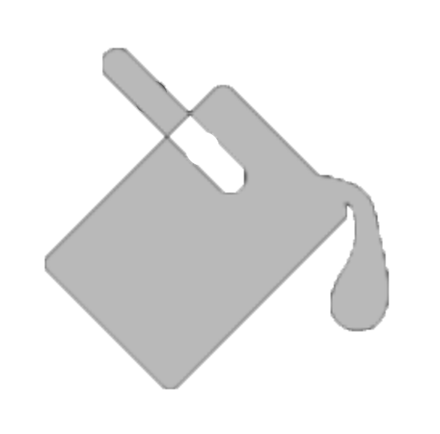
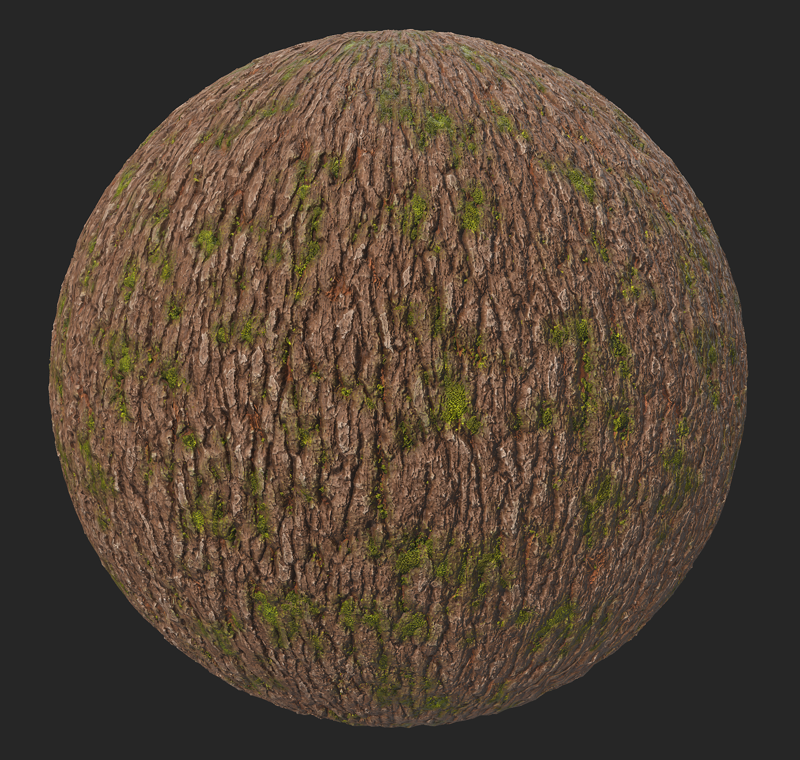
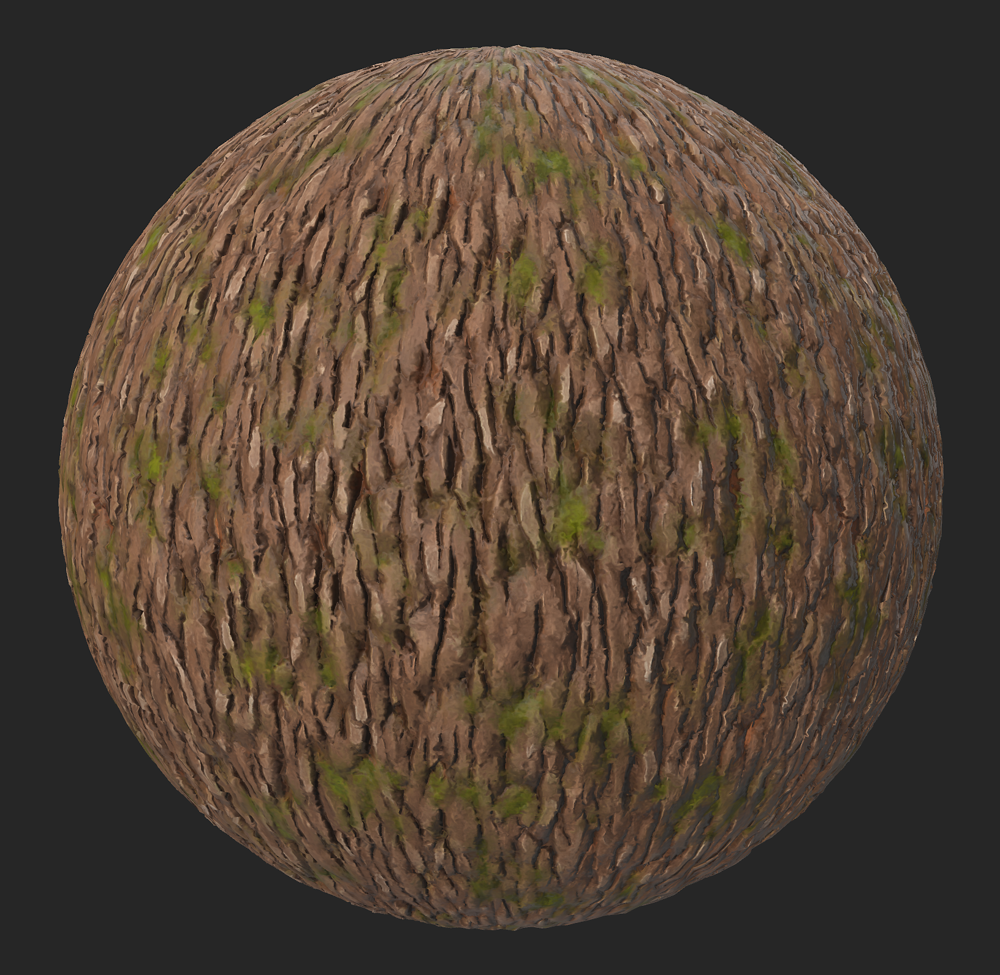

# Stylization

<table>
<tr style="border: 0;">
<td width="41.60%" style="border: 0;" valign="top">

<b>In:</b> Wear Finish

</td>
<td width="58.30%" style="border: 0;" valign="top">

## Description

Use the <b>Stylization filter</b> to modify your material look in order to simplify the details with different effects.

The images below show the bark material before and after having the Stylization filter applied.

</td>
</tr>
</table>

## Presets

<b>Stylization</b>

    The default preset applies a soft stylization effect by blurring out small details, and increasing contrast

<b>Contrasted Stylization</b>

    This preset applies a brushstrokes-like effect to the material

<b>Painterly</b>

    This preset applies a blurry and soft brushstrokes-like effect to the material

<b>Hand Painted</b>

    This preset applies more contrast than the previous ones, it mimics gouache or oil paint manual brushstrokes

## Basic parameters

* <b>Random seed </b>  
  The random seed that all other random parameters in this filter are based on.

* <b>Global filter intensity</b>: 0-1   
  Adjust how much the effects of this filter will be applied on your original material. Set to 1 to apply the full effect.

* <b>Contrast</b>: 0-1   
  Modify the level of contrast that applies on your material

* <b>Color Stylization intensity</b>: 0-1   
  Adjust how much the stylization effect of the filter will affect the color of your material

* <b>Roughness Stylization Intensity</b>: 0-1   
  Adjust how much the stylization effect of the filter will affect the roughness of your material

* <b>Metallic Stylization Intensity</b>: 0-1   
  Adjust how much the stylization effect of the filter will affect the metalness of your material

* <b>Height Stylization Intensity</b>: 0-1   
  Adjust how much the stylization effect of the filter will affect the height of your material

* <b>Normal Stylization Intensity</b>: 0-1   
  Adjust how much the stylization effect of the filter will affect the normal of your material

## Base color

* <b>Colorize Intensity</b>: 0-1   
  More vivid colors

* <b>Colorize Color</b>: Color   
  Lets you pick the color that the “Colorize Intensity” parameters tends to.

* <b>Color Variation Intensity</b>: 0-1   
  Adjust how much the intensity of the color is impacted by the color defined in “Color Variation”

* <b>Color Variation</b>: Color   
  Chose the color that will drive the “Color Variation Intensity” slider

* <b>Color Variation Contrast</b>: 0-1   
  Adjust the contrast in the color defined in “Color Variation”

* <b>Cavity Color Intensity</b>: 0-1   
  Adjust the intensity of the color that appears in the sunken areas of the material, color which has been defined in “Cavity Color”

* <b>Cavity Color</b>: Color   
  Defines the color which will be applied in the sunken areas of the material

* <b>Cavity Range</b>: 0-1   
  Defines how wide the sunken areas will be in the material.

* <b>Cavity Blur</b>: 0-1  
  Adjust the level of blur in the areas at the edge of the cavities of the material

* <b>Curvature intensity</b>: 0-1   
  Modify how visible the highest point of the materials will be, colored with the color defined in the “Curvature Color” parameter

* <b>Curvature Colorize Intensity</b>: 0-1   
  Adjust the opacity of the color defined in the “Curvature Color” parameter

* <b>Curvature Color</b>: Color   
  Define the color that will be applied on the highest points of the material

* <b>Curvature Blur</b>: 0-1   
  Adjust the level of blur around the areas colored by the “Curvature Color” parameter

## Grunge

* <b>Grunge Intensity</b>: 0-1   
  Adds a grunge map on top of the material. The grunge map can be chosen below.

* <b>Grunge Color</b>: color   
  Chose the color which will be used to apply the chosen grunge map

* <b>Grunge Roughness</b>: 0-1   
  Adjust the level or roughness which will be applied to the added grunge map

* <b>Grunge Metallic</b>: 0-1   
  Ajust the level of metalness which will be applied to the added grunge map

* <b>Grunge Roughness Variation</b>: 0-1   
  Chose the level of variation in the roughness applied to the added grunge map

* <b>Grunge Roughness Variation Intensity</b>: 0-1   
  Chose the level of variation of the intensity of the variation applied to the added grunge map

* <b>Grunge</b>: Image   
  Choose an image or a Texture Generator available in Sampler’s asset library to be used as a grunge map

## Technical parameters

* <b>Sharpen Intensity</b>: 0-1   
  Adjust the intensity of the global sharpening effect

* <b>Sharpen Radius</b>: 0-1   
  Adjust the radius of the global sharpening effect

* <b>Recompute normal</b>: Toggle   
  Allow Sampler to recompute the normal following the changes which have been applied to the material

* <b>Normal Intensity</b>: 0-1   
  Adjust the intensity of the Normal map

* <b>Normal Softening</b>: 0-1  
  Soften the normal for a smoother look to your material

* <b>Ambient Occlusion Intensity</b>: 0-1  
  Adjust the level of the contrast on the AO map
