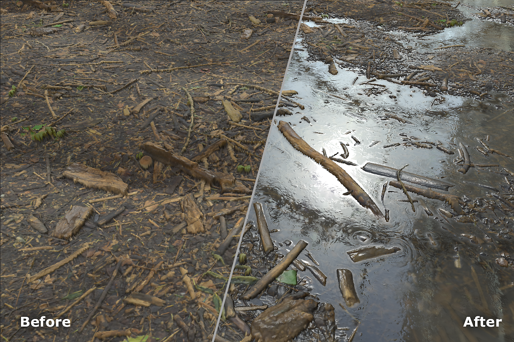

# Water

<table>
<tr style="border: 0;">
<td width="41.60%" style="border: 0;" valign="top">

**In:** Wear and Finish

</td>
<td width="58.30%" style="border: 0;" valign="top">

## Description

Use the **Erode filter** to wear away at high spots on your material.

</td>
</tr>
</table>

## Parameters

**Basic parameters**

* **Random Seed**:  
  The random seed determines the random values of other parameters that use randomness in this filter.
* **Water Level**: 0-1  
  Adjust the height of the water.
* **Water Darkness**: 0-1  
  Make the water lighter or darker.
* **Edges Wetness**: 0-1  
  Adjust how far above the water line the material appears wet.
* **Enable Dirt on Water**: toggle  
  Add dirt to the top of the water by modifying the roughness map slightly. The **Dirt section** only appears if this parameter is enabled.
* **Custom Mask**: toggle  
  When enabled the following additional control appears:
  * **Mask**: image/brush  
    Select an image to use as a custom mask or use the brush to paint a mask directly in the **2D view**.

**Dirt**

This section only appears if **Basic parameters &gt; Enable Dirt on Water** is enabled

* **Dirt Quantity**: 0-1  
  Adjust the amount of dirt floating on the waters surface.
* **Distortion Intensity**: 0-1  
  Control the amount of distortion of the surface dirt based on the intersection between the water and the rest of the material.
* **Dirt Border Intensity**: 0-1  
  Manage the strength of the surface dirt near borders of the dirt mask.
* **Dirt Border Distance**: 0-1  
  Control the distance of the dirt border from the intersection between the wet and dry areas of the material.
* **Border Precision**: 0-1  
  Adjust the precision of the dirt border.
* **Border warp**: 0-1  
  Warp the border to break up the uniformity of the dirt surface.

**Advanced Parameters**

* **Edges Wetness Distance**: 0-1  
  Control how far into dry areas the edge wetness extends.
* **Depth Blur Amount**: 0-1  
  Adjust how much the base color is blurred for areas that are underwater.
* **Depth Blur Opacity**: 0-1  
  Adjust how transparent the water appears.
* **Sludge Color**: color select  
  Change the color of the dirt that sits on top of the water's surface.
* **Sludge opacity**: 0-1  
  Adjust the transparency of the sludge.
