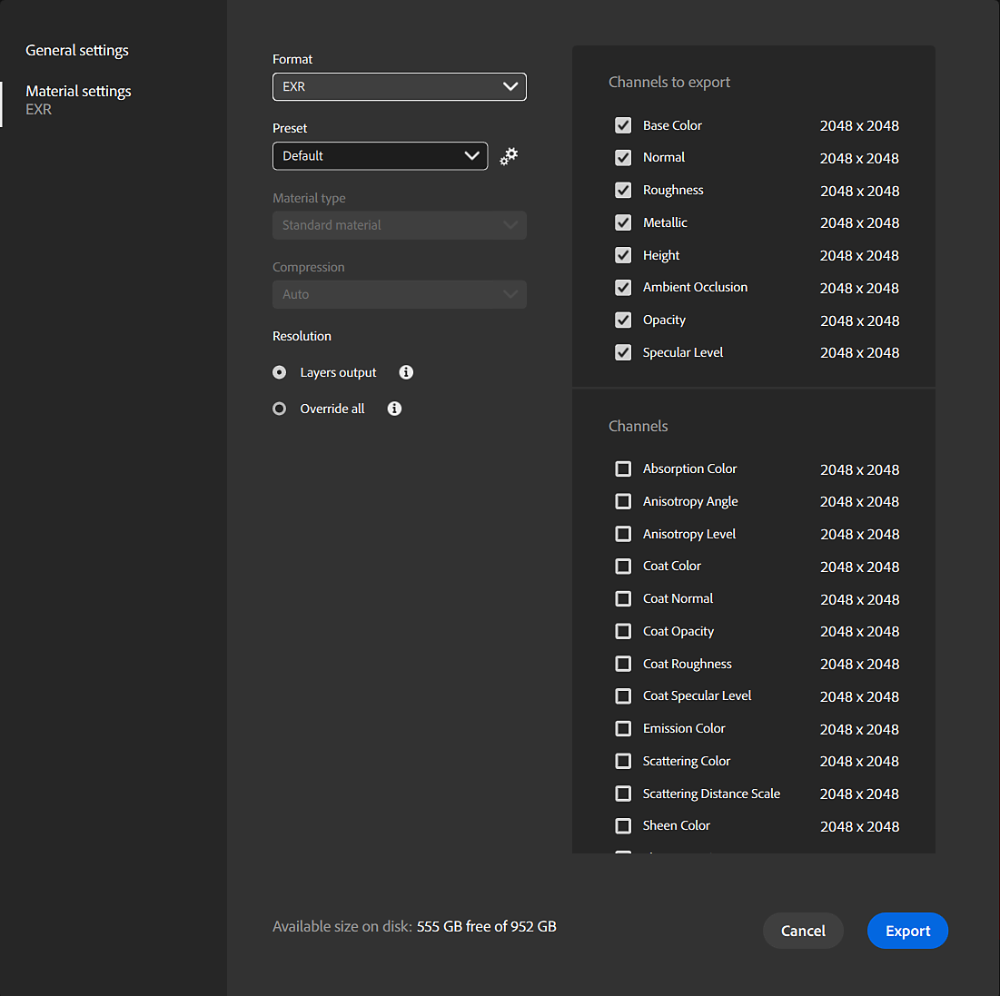

# Export

>[!IMPORTANT]
>
> Future change
> 
> Support for environment lights and meshes will be removed with the release of Sampler V5.2

Sampler supports major file formats for your assets:

* Materials as <b>Substance files</b> (.SBS and .SBSAR), or <b>bitmap textures </b>(.PNG, .JPG, .TIFF, ...)
* Environment lights as <b>Substance files</b> (.SBS and .SBSAR), or <b>textures</b> (.EXR)
* Meshes (USD/USDA/USDZ, glTF/GLB, obj, fbx, stl)

See the following pages for more information:

* [Export Window](../../help/guide/getting-started/export/export-window/export-window.md)
* [Default presets](../../help/guide/getting-started/export/default-presets/default-presets.md)
* [Managing custom presets](https://helpx.adobe.com/substance-3d/unlisted/documentation/sadoc/creating-and-importing-custom-presets-188976295.html)
* [Managing presets](../../help/guide/getting-started/export/managing-presets/managing-presets.md)
