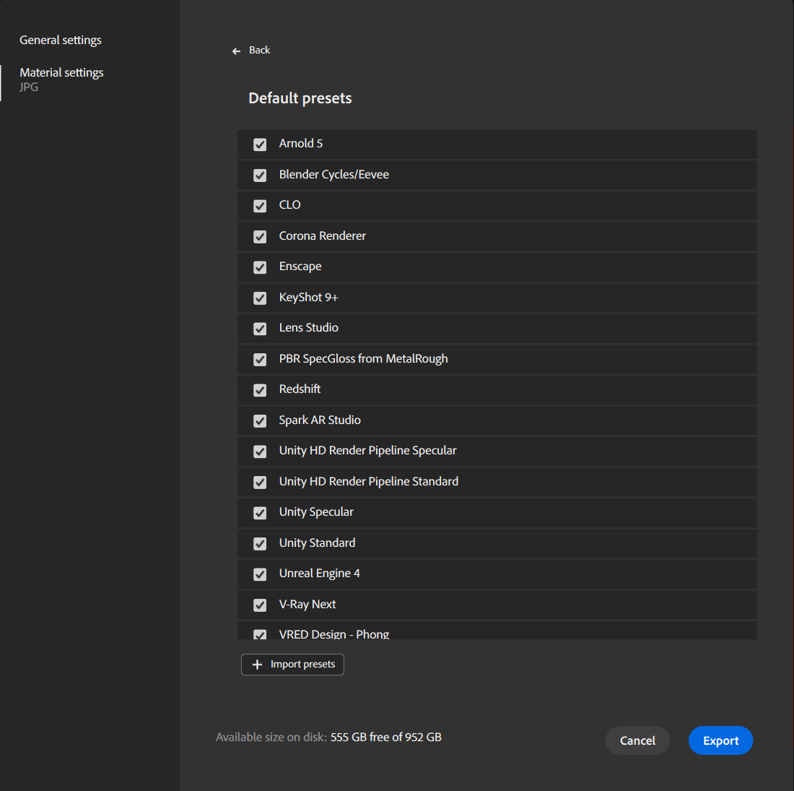

# Managing Presets

Presets allow you to quickly configure your exported file for a given application. You can also create custom Presets to fulfill your needs if you're using a pipeline not covered by the default presets.

## Use Presets

Presets are only available when exporting to an image file. When exporting to SBS or SBSAR, presets aren't needed.

To access Presets:

1. Open the <b>Export </b>window:
   1. Use the <b>Export panel</b> in the <b>Right bar</b>.
   1. Use<b> File &gt; Export as...</b>
   1. Use shortcut <b>Ctrl + E.</b>
1. On the left side of the <b>Export </b>window, select <b>Material settings</b>.
1. Select an image format (EXR, JPEG, PNG, TARGA, TIFF)
1. The Preset list appears.

{width="400px"}

Use the Presets dropdown to select a preset, or use the <b>Manage presets </b>button next to the dropdown to manage your presets.

## Manage Presets

Use the Presets dropdown to select a preset, or use the <b>Manage presets </b>button next to the dropdown to manage your presets.

## Default presets

{width="400px"}

For all default presets, you can activate/deactivate them. If a default preset is deactivated, it won't be visible in the Preset drop-down list.

By default all presets are activated.

## Custom presets

You can activate/deactivate custom presets. If a custom preset is deactivated, it won't be visible in the Preset drop-down list.

You can also:

* <b>Rename</b>: Change the name of the preset in the interface.
* <b>Replace</b>: Change the file of your preset to a new version.
* <b>Delete</b>: Delete the preset.
