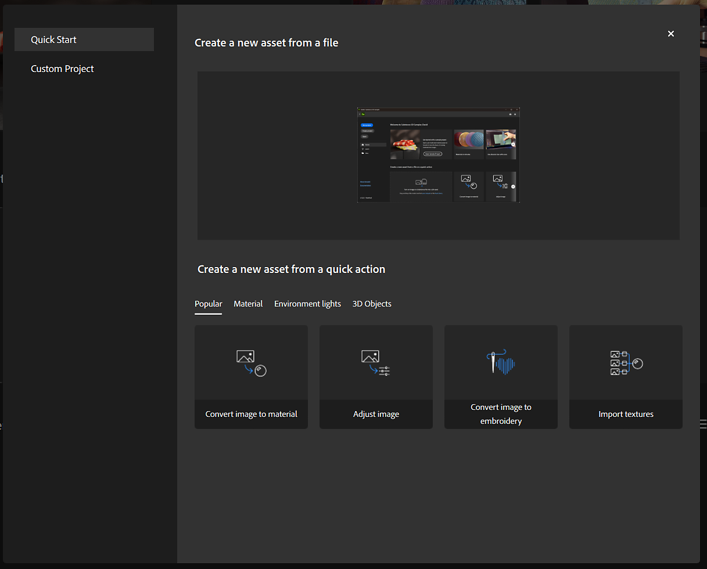
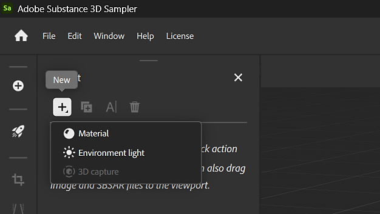

# Import resources

Sampler can use external resources like images and Substance files to modify your project. Use any of the following options to import a file to your project:

* Drag and drop a file from your file explorer onto the Sampler window. An import window appears with options to change how the import is handled.

* From the <b>Left bar</b> use the <b>Get content </b>button, then select either <b>Import in Layer Stack</b>, or <b>Import in Your Assets</b>. Both options will open a file explorer where you can navigate to and select the file or files to import.
  * <b>Import in Layer Stack</b> imports the file for your current project.
  * <b>Import in Your Assets</b> imports the file so it can be accessed from any project.

* In the <b>Layers</b> panel, if no layers have been created, you can use the available links to import a file to form the base of your material.

>[!NOTE]
>
> Resources are linked and not imported. As a consequence, if a resource file is moved or deleted, materials or content created with that resource will be affected. As a result, we recommend using a dedicated folder for Sampler Assets.
> 
> By default, Sampler's included assets are stored under C:\Program Files\Adobe\Adobe Substance 3D Sampler\Resources\assets

## Supported file formats

| Type | Description |
| --- | --- |
| <b>Bitmaps / Images</b>  (JPEG, PNG, etc) | You can drag and drop or import your bitmaps in the <b>Layers </b>panel, or into SBSAR or filter parameters that allow an image input. |
| <b>Substance Packages</b>  (SBSAR) | You can import SBSAR files into the <b>Assets </b>panel or into the <b>Layers </b>panel. |

 