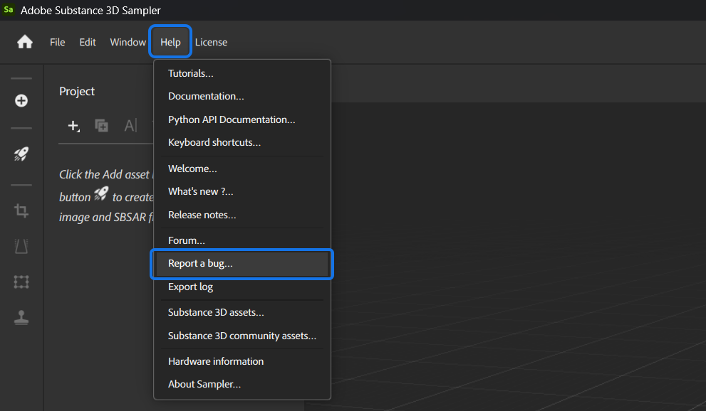

# Report a bug

You can report bugs from within Sampler.

Open the <b>Help </b>menu, then select <b>Report a bu</b>g:

{width="700px"}

Fill the following form:

{width="400px"}

Then hit submit. The information that you've entered will be shared directly with the Sampler development team.
