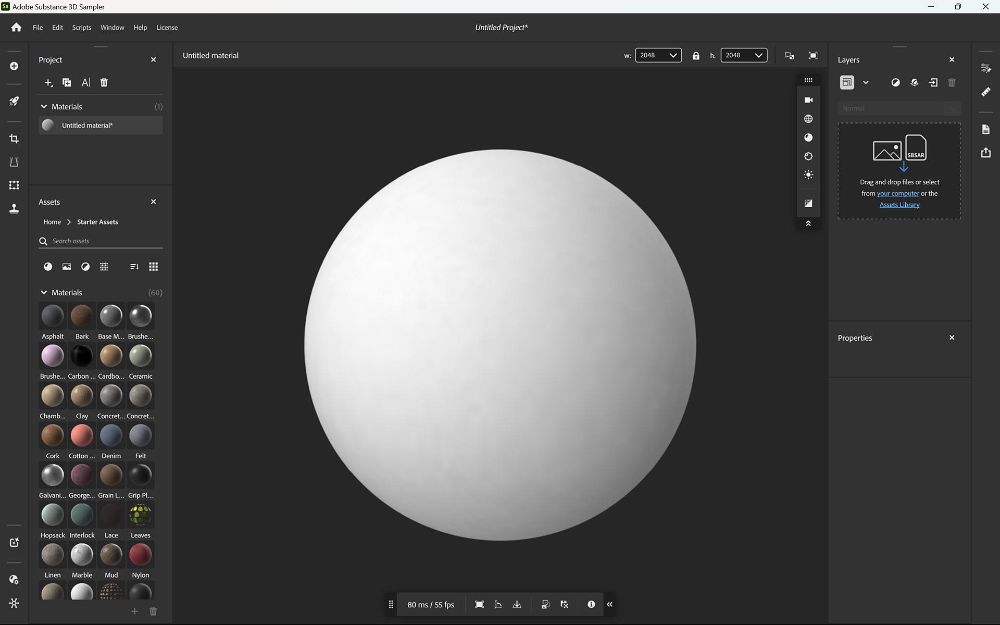
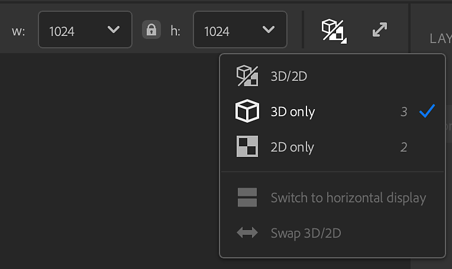
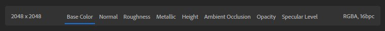

# 2D and 3D Viewport

The **Viewport** displays your current asset. At the top of the **V****iewport** you can see the name of your asset and options to change the **Viewport** appearance. Use these options to:

* Change width and height of your asset in pixels.
* Display either <b>2D view</b>, <b>3D view</b>, or display both <b>2D </b>and <b>3D views </b>together.
* Switch the <b>split view</b> to horizontal display.
* Swap <b>3D and 2D views</b>.
* Toggle between the standard and full screen viewport.

## 3D View

The <b>3D Viewport</b> has two toolbars that allow you to make changes how your asset appears in the <b>Viewport</b>. By default, these toolbars appear in the top right corner, and in the bottom center of the <b>3D Viewport</b>.

>[!NOTE]
>
> The <b>3D Viewport</b> toolbars can be repositioned:
> 
> * You can move the toolbars by dragging the handle at the top or left side of the toolbar.
> * Double click the handle at the top or left side of the toolbar to switch between horizontal and vertical layouts.
> * Click the double chevrons on the bottom or right side of the toolbar to minimize the toolbar.

The toolbar at the top right of the <b>3D Viewport </b>has controls focused on the appearance of the viewport:

* <b>View</b>: Change camera settings like field of view or projection mode. Additionally, change the grid and background colors.
* <b>Mesh</b>: Select a different mesh to show your material assets, or see nuances of Environment light assets.
* <b>Material</b>: Change the position and tiling of the texture on your mesh.
* <b>Displacement</b>: Adjust displacement quality and intensity.
* <b>Light</b>: Select and adjust an environment light, including settings like turning on shadows and the ground plane.
* <b>Toggle path tracing</b>: Path tracing is a rendering technique that provides photorealistic results, improving the appearance of your assets. However, path tracing can be computationally expensive, here you can turn path tracing on or off depending on your needs.

>[!NOTE]
>
> Turn shadows on to improve viewport visuals. Keep shadows off to improve Samplers performance.

The toolbar at the bottom center of the <b>3D Viewport</b> has the following information and controls:

* <b>Frame time/FPS</b>: These values show the performance of the material.
* <b>Frame object</b>: Center the camera on the mesh.
* <b>Change up axis</b>: Change which axis is considered up. This can help correct for issues with imported meshes.
* <b>Placement</b>: Change how the mesh is positioned relative to the ground plane.
* <b>Copy snapshot</b>: Quickly copy an image of the current <b>3D Viewport</b> to the clipboard.
* <b>Save snapshot</b>: Save a snapshot of the <b>3D Viewport</b> to an image file.
* <b>3D View controls</b>: View a quick reference for camera controls in the 3D Viewport.

## Move the camera

The viewport uses a camera to render the 3D view. You can move the camera to change the your view and see your creations from different angles.

| Shortcut | Movement | Description |
| --- | --- | --- |
| Click + drag | Orbit | Rotate the camera. It is not possible to roll the camera. |
| Right click + drag | Dolly | Move the camera forwards and backwards. |
| Middle click + drag | Pan | Move the camera left, right, up, and down. |

The <b>2D view</b> is two dimensional, so there is no orbit option. Right click + Alt + drag will zoom in and out, while middle click + Alt + drag will pan.

In both the <b>3D view </b>and the <b>2D view</b> use <b>F</b> to focus on your asset. This is helpful if you lose sight of the 3D asset or the 2D space.

## 2D view

By default, only the <b>3D view</b> is visible, however the <b>2D view</b> can hold a lot of useful information and controls for some filters.

To open the <b>2D view</b> use the <b>View selection button </b>at the upper right of the viewport. You can also use shortcut <b>2</b> to quickly switch to the <b>2D view</b>.

With the <b>2D view </b>open, some new options appear:

* In the upper right corner of the **2D view**, use the dropdown to change the source of channels available to view.

  * Layer Inputs show the channels being input to the selected layer
  * Layer Outputs show the channels being output by the selected layer
  * Material Outputs shows the channels being output by the top layer and is not affected by layer selection.
* At the bottom of the **2D view**, you can:

  * See the resolution of the selected channel.
  * Select a channel to view it in the 2D view.
  * See color channels and bit depth for the selected material channel.

  
