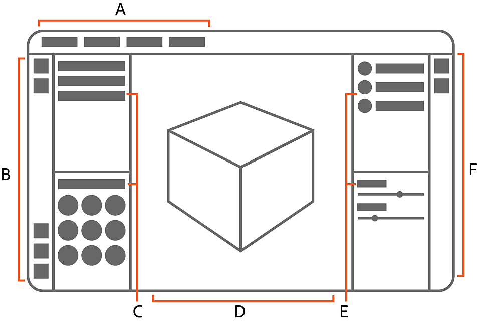

# Interface

Sampler's workspace is made up of the 2D and 3D viewports, the left and right Sidebars, and a collection of panels. Each panel is dedicated to a specific purpose, so different panels are useful during different parts of the creative process.

<table>
<tr style="border: 0;">
<td style="border: 0;" valign="top">

## Workspace overview

The workspace is where you will spend most of your time in Sampler. By default the workspace consists of six areas:

A. The <b>Application menu bar</b> shows the current project name. It also holds the File, Edit, Window, Help, and License menus.  
B. The <b>Left sidebar</b> holds shortcuts to Quick actions and certain tools, as well as the <b>Generative</b>, <b>Shader settings</b>, and <b>Channel settings</b> panels.   
C. The <b>Project</b> and <b>Assets panels.  
</b>D. The <b>2D </b>and <b>3D Viewports</b> displays the asset you're currently working on.  
E. The <b>Layers</b> and <b>Properties panels.  
</b>F. The <b>Right sidebar</b> gives access to the <b>Exposed parameters</b>, <b>Physical size</b>, <b>Metadata</b>, and <b>Export panels.</b>

The <b>Application menus</b> are covered in more detail below. <b>Panels</b>, the <b>Viewport</b> and the <b>sidebars</b> each have their own articles.

</td>
<td style="border: 0;" valign="top">

{zoomable="yes"}

</td>
</tr>
</table>

## Customize the workspace

Sampler's workspace is fully customizable, so you can find a layout that works best for you. If you ever want to reset the panels to the default layout, use **Window &gt; Reset to default layout**.

## Rearrange panels

Click and drag the title of a panel to start moving it.

You can dock a panel on the edges of the viewport or other panels: drag the panel over the edge where you'd like it to be docked and a blue highlight guide will appear. When you see the line appear, drop the panel to dock it.

## Open and close panels

Use the X at the upper right of a panel to close it. Closed panels are stored in the sidebars.

To open a panel again, click the relevant icon for the panel in either the left or right sidebar. This opens the panel temporarily. Drag the panel out to keep it open permanently.

<table>
<tr style="border: 0;">
<td style="border: 0;" valign="top">

The Left Sidebar holds the following panels when they're closed:

* Quick Actions
* Assets
* Generative
* Project
* Shader Settings
* Channel Settings

</td>
<td style="border: 0;" valign="top">

The Right sidebar holds the following panels when they're closed:

* Layers
* Properties
* Exposed parameters
* Physical Size
* Metadata
* Export

</td>
</tr>
</table>

## Application Menus

The **Application** **menu** **bar** shows the current project name. It also holds the File, Edit, Window, Help, and License menus.

Use the <b>File</b> menu to create a new project, open an existing project, or save or export your current project.

Use the <b>Edit</b> menu to undo and redo actions or access your preferences. Learn more about Sampler's Preferences [here](preferences/preferences.md).

Use the <b>Window</b> menu to reset your workspace to the default layout.

Use the <b>Help </b>menu to learn more about Sampler or find out how to fix issues.

|  |  |
| --- | --- |
| Tutorials | Opens Sampler's tutorials page. Tutorials cover everything from the basics of using Sampler to advanced techniques that can accelerate your work. |
| Documentation | See the documentation. The documentation provides information on all aspects of using Sampler. |
| Python API Documentation | Learn how to use Sampler's Python API to automate tasks. |
| Keyboard Shortcuts | See a full list of keyboard shortcuts. Using shortcuts can help you work faster than relying on your cursor alone. |
| Welcome | Open the <b>Welcome window</b> to learn more about what's possible in Sampler. |
| What's new? | Open the <b>What&#39;s new window</b> to see what's changed in the most recent release of Sampler. |
| Release notes | See what changed in recent versions of Sampler. |
| Forum | Open the forums to join the conversation with other members of the Substance 3D Sampler community, or submit your own posts and suggestions. |
| Report a bug | Report a problem with Sampler. |
| Export log | This can be useful for troubleshooting issues that might occur while using Sampler. |
| Substance 3D assets | Open Substance Source for access to a huge library of materials and other assets created and curated by the Substance 3D team. |
| Substance 3D community assets | Open Substance Share for access to a library of materials and other assets created by members of the Substance 3D community. |
| Hardware information | See information about your devices hardware. |
| About Sampler | See information about your installed version of Sampler. |

From the **License** menu, use Manage my account to access your Adobe account. Sign out of your Adobe account by clicking sign out.

 