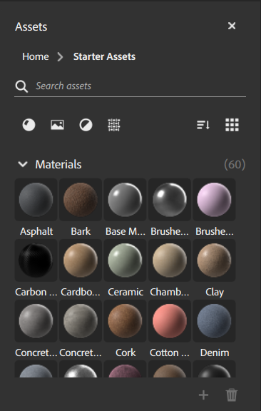
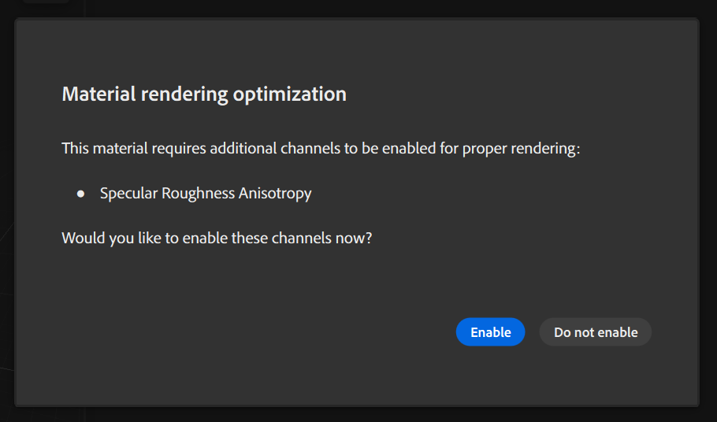

# Assets panel

The **Assets panel** holds assets that you can use to build your creations. Sampler includes a collection of materials, filters, and texture generators to help you get started.

The **Assets panel** has some controls to help organize and find assets:

* Use the search bar to find assets quickly.
* Filter assets by type.
* Group assets by type or by category.
* Switch between list and icon view.

## Add assets to the Assets panel

To add your own assets to the assets panel, click the **+** at the lower right of the **Assets panel**. Browse to the location of your asset, select it, and click **Open**. You can remove custom assets from the **Assets panel** by dragging them over the trash can.

## Activate additional channels

When drag and droping materials from the asset panel to your layer stack, you might be offered to activate extra channels. It is offered when the material outputs a channel which is not currently activated in your asset. You might want to activate it if you want to benefit from the full complexity of the material, like some anisotropy effects or coating.

>[!NOTE]
>
> Only custom assets can be deleted in the **Assets panel**. It is not possible to delete Sampler's default assets.
