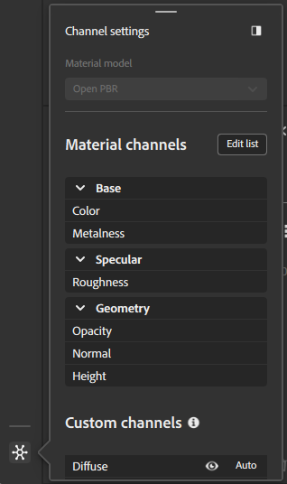
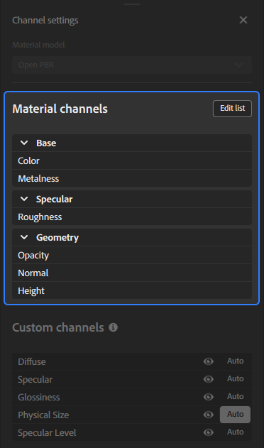
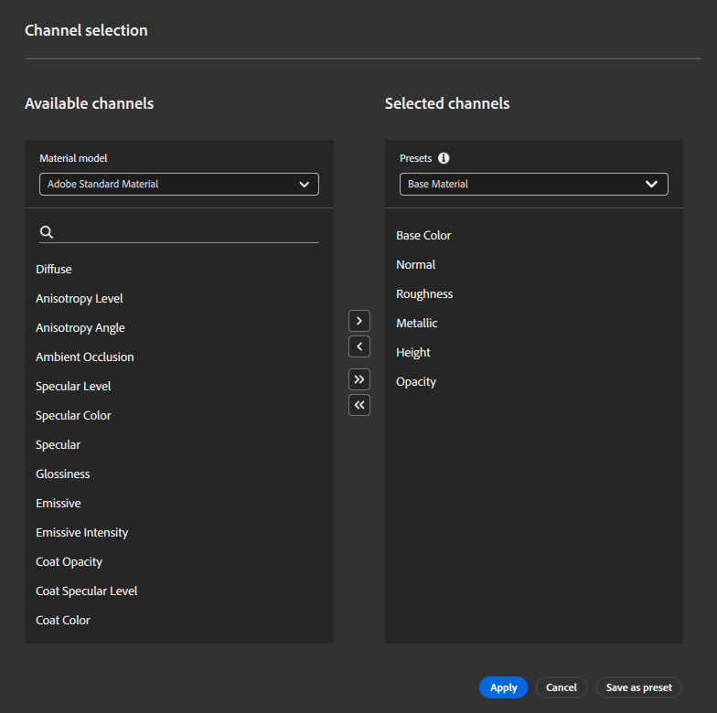
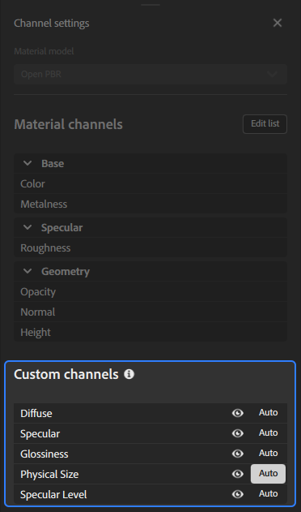

# Channel Settings panel

<table>
<tr style="border: 0;">
<td style="border: 0; width: 30%" valign="top">

The **Channel Settings** panel controls the list of channels computed for your current material. You can manage channel visibility, add or remove channels from your material, or change the material model being used.

</td>
<td style="border: 0;" valign="top">

</td>
</tr>
</table>

## Material model

Use this dropdown to select the shader framework used to render your material. Options in the **Channel settings panel** will change based on the selected material model.

When you change the material model, your layer stack will need to be recalculated for the new model, and different channels will be made available. Sampler tries to minimize data loss in the conversion; however it is possible that the change will result in subtle differences in appearance with a new material model.

>[!NOTE]
>
> It is possible to change from Adobe Standard Material(ASM) to OpenPBR, but it is not currently possible to change from OpenPBR to ASM.

## Material channels

<table>
<tr style="border: 0;">
<td style="border: 0; width: 30%" valign="top">

This section displays the list of channels that are computed by default based on the workflow.

You can use the **Edit list button** to open **Channel selection** and change which channels are computed for your material. 

</td>
<td style="border: 0;" valign="top">

{width="200px"}

</td>
</tr>
</table>

>[!NOTE]
>
> Some materials from Substance Source don't output opacity or ambient occlusion channels for example. Even if the opacity channel is marked as "is computed", if the Substance file doesn't output it, Sampler doesn't generate it.

### Channel selection

The Channel selection window lets you add or remove channels from your material.

To add a channel to your material, select an available channel and use the **> button**.
To remove a channel from your material, select the channel from the **Selected channels list** and use the **< button**.
You can add all available channels to your material with the **≫ button** or remove all channels from your material with the **≪ button**.

You can also use presets to quickly select a list of channels for your material. By default, Sampler includes a number of presets, but you can also create your own:

1. Add the desired channels to your material.
1. Use the **Save as preset button**.
1. Name your preset.

>[!NOTE]
>
>Saving a preset does not apply the preset to your material. 

## Custom channels

Toggle additional channels that are not included with the selected workflow by default.

<table>
<tr style="border: 0;">
<td style="border: 0; width: 30%" valign="top">

Each custom channel has two options that you can use to control it:

1. Use the Visibility toggle to show or hide the channel in the 2D View.
2. Use the **Auto button** to toggle whether the channel is automatically computed. 
    * When turned on, the channel will be computed if a layer above it in the stack requests it.
    * When turned off, the channel is always computed.

</td>
<td style="border: 0;" valign="top">

{width="200px"}

</td>
</tr>
</table>

    