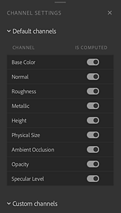
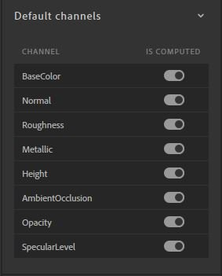
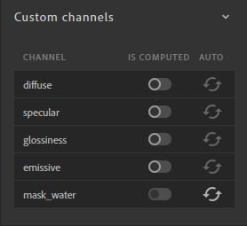

# Channel Settings panel

The **Channel Settings** panel controls the list of channels computed for your current material. You can manage visibility of channels here.

{width="200px"}

## Default channels

This section displays the list of channels that are computed by default based on the workflow.

{width="200px"}

>[!NOTE]
>
> Some materials from Substance Source don't output opacity or ambient occlusion channels for example. Even if the opacity channel is marked as "is computed", if the Substance file doesn't output it, Sampler doesn't generate it.

## Custom channels

Toggle additional channels that are not included with the selected workflow by default.

{width="200px"}

In order to avoid useless computation, each custom channel has 3 statuses to define if it's necessary to compute it.

| Status | Description |
| --- | --- |
| Auto | The channel will be computed if a layer above it in the layer stack requests it |
| On | The channel is always computed |
| Off | The channel is never computed |
