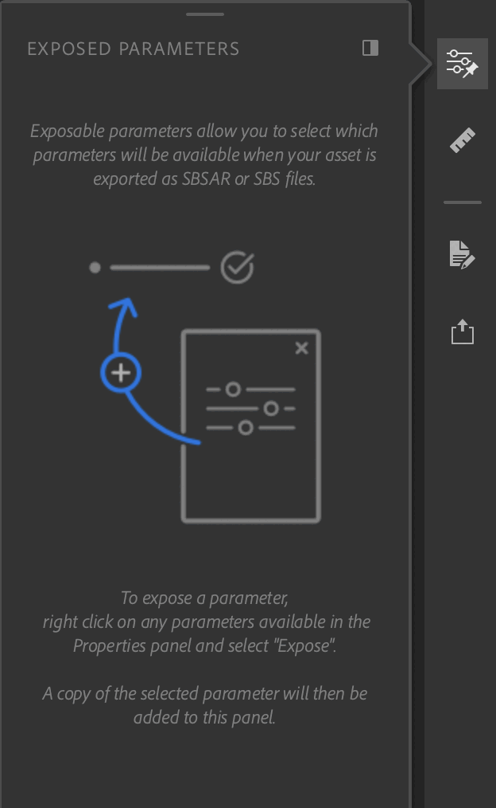
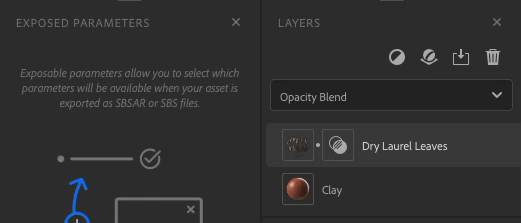

# Exposed Parameters Panel

The **Exposed Parameters panel** holds the parameters exposed from the **Properties panel.**

The colored dots serve to help visualize which layer the parameter is connected to. Empty dots indicate that the parameter is from a blend layer.

There are a few ways to interact with the exposed parameters:

| Actions | How to |
| --- | --- |
| Unexpose a parameter | Right click on a parameter and select "Unexpose". |
| Edit the label of a parameter | Right click on a parameter and select "Edit", enter the new label. |

You can interact with all parameters as you normally would with the **Properties panel.** Changes will be reflected in the 3D viewport.
