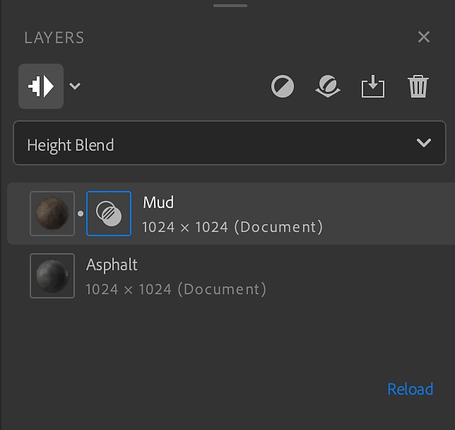
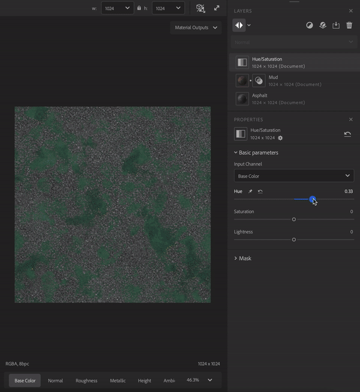
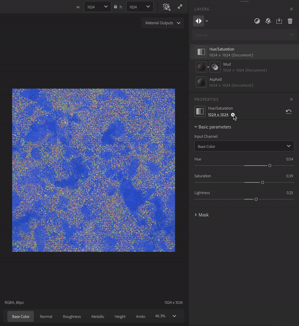

# Layers panel

<table>
<tr style="border: 0;">
<td style="border: 0; width: 70%" valign="top">

The **Layers panel** holds the layer stack and shortcuts to manage your layers. The **Layers panel** works closely with the **Properties panel** - select a layer from the **Layers panel** to see its properties in the **Properties panel.**

The **Layers panel** consists of three main sections:

1. The tools section holds buttons that you can use to
   1. Show/Hide layers resolution
   1. Switch layers resolution strategy
   1. Add a layer
   1. Add a base material
   1. Import a custom filter
   1. Remove a layer
1. The **Blend mode selector** lets you adjust how a layer blends with the layers below it. The **Blend mode selector** is only available when a material layer is selected - filters do not use blend modes.
1. The **Layer stack** contains all the layers that make up your asset.

</td>
<td style="border: 0;" valign="top">

</td>
</tr>
</table>

## The Layer stack

The layer stack is the collection of materials, filters, and other resources that make up your current material. Like in Photoshop and Substance 3D Painter, the layer stack works from the bottom layer first to the top layer last. This means that each layer can affect the layers below it.

There are a few ways to manage the layer stack:

| Actions | How to |
| --- | --- |
| Add a layer | Drag an asset from the **Assets panel** into the viewport to add it to the top of the layer stack. Drag an asset from the **Assets panel** into the layer stack to add it to a specific location in the layer stack. Use the **Add a layer** button from the tools section to select a filter from a list. |
| Move a layer | Drag a layer in the layer stack to move it. When moving a layer, a bar will appear which indicates where the layer will be put. |
| Delete a layer | Click a layer to select it and press **Del** or use the **Remove a layer** button in the tools section. |
| Toggle visibility | Hover over a layer to see the **Visibility toggle** on the right side of the layer. When the visibility of a layer is toggled off, it will not be computed. |
| View layer Properties | Click a layer to open view it's properties in the **Properties panel.** |
| Show/Hide resolution | Click on the top left button of the **Layers panel**. |
| Switch all layers resolution | Click on the arrow next to the "show/hide resolution" button, select the strategy for all layers in stack. |
| Switch a layer resolution | Click on a layer to open it's properties, click on the resolution on the **Properties panel**, select the resolution strategy the layer will use. |

## Layer types

There are three types of layer:

* Materials
* Filters
* Images

### Material layers

A material layer contains information in multiple channels and can be blended with the layers below it. Material layers appear slightly differently depending on if they are at the bottom of the stack or not. For example, the image below shows a rock material dragged into the layer stack twice - notice that the bottom layer has no icon to control the blend, while the top layer does.

The general rules for material layers are:

* A material layer always uses document resolution.
* A material layer at the bottom of the stack has nothing to blend with so the **Blend mode selector** is unavailable.
* A material layer not at the bottom of the stack can blend with the layers below it, so you can use the **Blend mode selector** to change the blend mode. Additionally, a **blend icon** appears next to the **layer icon**. Select the **blend icon** to adjust blend settings for the layer based on which blend mode has been selected.

### Filter layers

Filters perform operations on the layers below them to create specific effects. For example, in the image above the **Hue/Saturation filter** allows you to adjust the hue, saturation, and lightness of the layers below.

Some filters can take one or more other layers as inputs. For example:

* The **Atlas Scatter filter** can take a material as an input.
* The **Atlas Scatter filter** will scatter instances from the input atlas material based on the **Atlas Scatter** parameters.

Drag a material over a layers input slot to use it as an input.

A filter layer will use the default resolution strategy set in the preferences. You can change the resolution the filter will use in the properties panel.

### Image layers

Image layers use their own resolution and are mainly in the Image to material workflow. Like material layers, you can create an image layer by dragging an image from the **Assets panel**.

You can drag an image from your system's file browser into Sampler, if there are already layers in your layer stack, the image layer will be added to the top of the stack. If there are no layers in the layer stack a dialog will appear where you can choose how to process the image:

* **Image to material** allows you to use AI to convert an image into a material.
* **Multiangle to material** lets you use multiple images with different lighting conditions to create a material.
* **Texture import** lets you use imported images as texture channels to build up a material.
* **Use as bitmap** imports the image as a simple bitmap layer.

You can also drag multiple selected images into the layer stack at once to import them all as a single layer. This can be helpful for multi-image filters like **HDR Merge** and **Multiangle to Material**. Select the layer with multiple images to change the channel data for each image.
