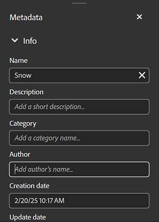
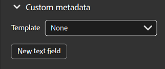

# Metadata panel

{width="500px"}

In the metadata panel, you can access and modify the metadata of your asset.

<b>Name</b>: The name of the asset.

<b>Description</b>: Description of your asset or description embedded in the Substance material

<b>Category</b>: Category of your asset or category embedded in the Substance material

<b>Author</b>: Author of your asset or author embedded in the Substance material. By default, the author's name is the name of your OS account.

<b>Creation date</b>: Creation date of your asset in Sampler or the date of import to Sampler. (This cannot be edited)

<b>Update date</b>: The last date your asset was updated. (This cannot be edited)

<b>Tags</b>: Tags of your asset or tags embedded in the Substance material.

<b>Physical size</b>: X, Y, and Z size of your asset.

<b>Rating</b>: Rating of your asset.

## Custom Metadata

All custom metadata will be included in the material file (SBSAR) to ensure a more efficient workflow for sharing digital materials across applications.

{width="350px"}

<b>New text field </b>(add a custom field for metadata):

1. Insert name. The name of a custom metadata must be a valid XML element name (i.e. : no spaces or special characters, does not start with a number...)
1. Insert description/note

Modify custom metadata fields by hovering your cursor over the field and selecting either the edit or delete button that appears.

 