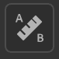

# Physical Size Panel

<table>
<tr style="border: 0;">
<td width="41.60%" style="border: 0;" valign="top">

</td>
<td width="58.30%" style="border: 0;" valign="top">

Use the <b>Physical Size Panel </b>to configure the real-life physical size of your scanned samples and images<b>.</b>

</td>
</tr>
</table>

Match the real-life physical size of your scanned samples and images in a digital context to create physically accurate visuals across applications.   
The following tools and parameters let you define the physical size of your materials and create accurate and realistic visuals when applying material on an object.

## Set physical size

>[!NOTE]
>
> To set the Physical size of your material, you need to have an image(s) import layer.

In order to compute the physical size of your sample/image enable <b>Set physical size</b>.

### Input image size

This section allows you to manually set the size of your sample and provides tools to calculate the physical size automatically.

<b>Reference layer:</b> Reference the image from which the physical size is calculated.  
<b>Width (X): </b>Set the physical width of the reference layer  
<b>Height(y): </b>Set the physical height of the reference layer  
<b>Tools:</b>

Measure diagnostics allows you to measure the distance between two points on your image (for informative purposes only).

Auto measure tool allows you to get an estimated physical size of your sample based on the image metadata (dpi). This method is only accurate with scanned samples.

Measure tool allows you to calibrate the physical size by designating the physical distance between two features of the sample. This is usually the best method to calculate the physical size of your sample.

### 3D mesh surface

These tools let you set the aspect of the surface of your material.

**Physical scale:** Enable or disable the physical scale. The physical scale is the circumference of the mesh along the three axes.  
Scale your material with physical values. Manipulating the width (X) the Height (Y) and the Depth (Z).  
**Texture tiling:** Set the tiling of your material

### Output material

Help you visualize the output of your material with its real life aspect.

**Display with physical ratio:**   
The display in the 2D viewport respects the physical ratio.  
**Height scale:** Set/calculated from the 3D viewport based on the physical scale.
