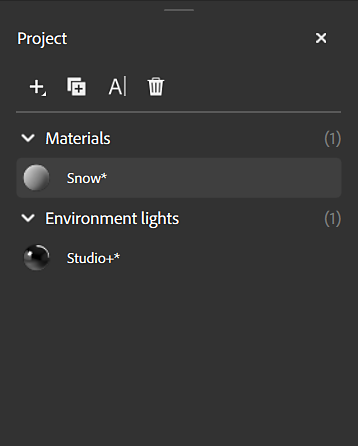

# Project panel

Projects in Sampler act like packages that can store multiple assets. The <b>Project panel</b> displays the assets that make up your current project.

Controls at the top of the Project panel allow you to add or manage assets in your current project:

* Use the <b>Add</b> button to create a new Material or Environment light.
* Use the <b>Duplicate </b>button to duplicate the currently selected asset.
* Use the <b>Rename </b>button to rename the currently selected asset.
* Use the <b>Delete </b>button to delete the currently selected asset.

>[!NOTE]
>
> You can also right click any asset to Rename, Delete, or Duplicate it; or open the assets file location.

Click one of your assets to load them in the <b>Viewport</b>, or drag an asset onto the <b>Layers panel</b> to use it in other compatible assets.
