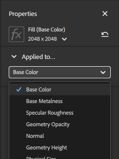
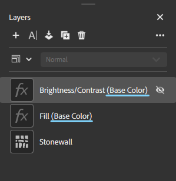

# Properties panel

The **Properties panel** shows parameters and properties of layers that you select in the **Layers panel**. The best way to find out what parameters do is to play with them and see what impact they have on your asset.

The parameters that appear in the **Properties panel** depend on what you've selected in the **Layers panel**. Sometimes one layer can have more than one set of customizable properties, for example a material layer that isn't at the bottom of the stack will have blend properties. Each icon in the layer stack is a different set of properties and parameters. For a material layer with both material properties and blend properties, there will be two icons on that layer.

<table>
<tr style="border: 0;">
<td style="border: 0; width: 30%" valign="top">

</td>
<td style="border: 0;" valign="top">

In this image of the **Layers panel**, each icon in the layer stack has a different set of parameters to control the appearance of your material. For example, the Clay layer has both the material icon, and the blend icon, each of which has a separate set of parameters. The Roll Paint layer also has both material and blend icons, but because it is being hovered, also has a visibility toggle.

</td>
</tr>
</table>

## Applied to...

The **Applied to** section of the **Properties panel** lets you control which channels the current layer affects. Like with other properties, the channel settings are different based on whether the layer or the blend is selected. 

By default, all channels are toggled on for the majority of materials and filters. Some filters, such as Brightness or Vibrance, only impact a single channel. When filters only affect a single channel, you can see the affected channel next to the layer name.

