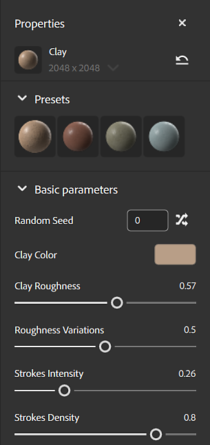
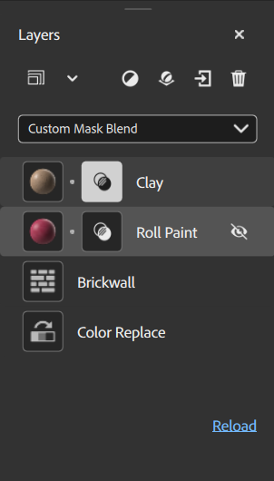

# Properties panel

The <b>Properties panel</b> shows parameters and properties of layers that you select in the <b>Layers panel</b>. The best way to find out what parameters do is to play with them and see what impact they have on your asset.

The parameters that appear in the <b>Properties panel</b> depend on what you've selected in the <b>Layers panel</b>. Sometimes one layer can have more than one set of customizable properties, for example a material layer that isn't at the bottom of the stack will have blend properties. Each icon in the layer stack is a different set of properties and parameters. For a material layer with both material properties and blend properties, there will be two icons on that layer.

In the above image of the <b>Layers panel</b>, each icon in the layer stack has a different set of parameters to control the appearance of your material. For example, the Clay layer has both the Clay icon, and the blend icon, each of which has a separate set of parameters.
