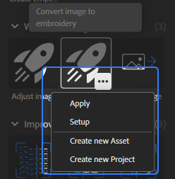

# Quick actions panel

[Quick actions](../../features-and-workflows/quick-actions.md) are a collection of features and workflows that let you perform powerful actions in just a few clicks. Use Quick actions to create a material, create a project, or to add the layers you need to your existing stack.

From the quick action panel click on a Quick action to add it to the stack or create a new asset depending on the Quick action type. Quick actions are divided into the following categories:

* **Recent**: Access your most recently used Quick Actions.
* **Work on images**: Import, convert or adjust images.
* **Improve material scan**: Align, refine, or tile a scanned material to get better results.
* **Create a material from image(s)**: Add the necessary layers to your layer stack to convert one or more images into a material.
* **Create a material from scratch**: Create a new material asset with starting layers.

When you hover over a quick action, you can use the options button that appears to:

* **Apply** the quick action to the layer stack.
* **Setup** the quick action through dialogs.
* **Create a new asset** using the selected quick action.
* **Create a new project** using the selected quick action.

