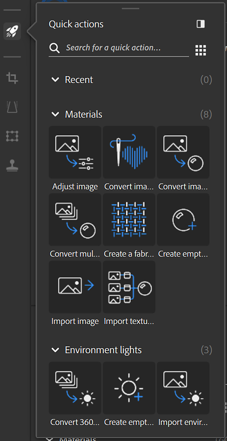

# Quick actions panel

[Quick actions](../../../help/guide/features-and-workflows/quick-actions/quick-actions.md) is a system that allows to create an asset or add many layers in the stack in few clicks. Use Quick actions to create an asset, create a project, or to add the layers you need to your existing stack.

From the quick action panel click on a Quick action to add it to the stack or create a new asset depending on the Quick action type.

Options:

* <b>Apply:</b> Applies the quick action to the active stack.
* <b>Setup:</b> Opens the Setup window to prearrange the Quick action before adding it to the stack.
* <b>Create new Asset:</b> Create a new asset from the selected Quick action.
* <b>Create new Project: </b>Create a new project from the selected Quick action.

Learn more about Quick actions [here](../../../help/guide/features-and-workflows/quick-actions/quick-actions.md).
