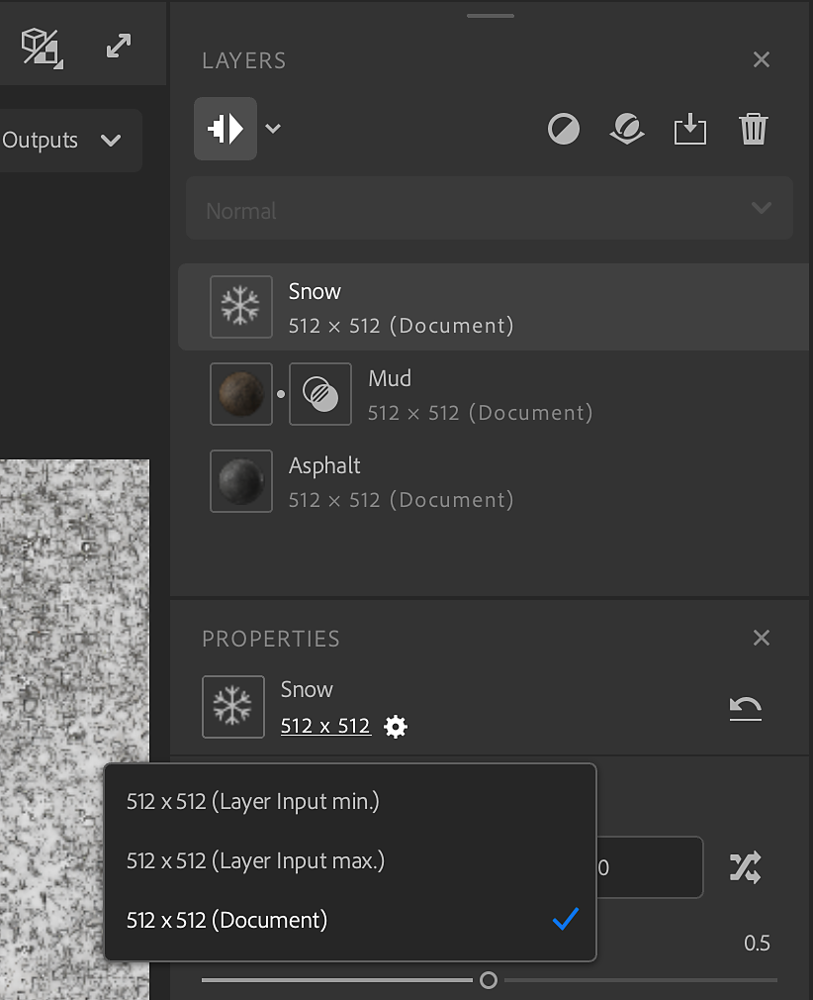
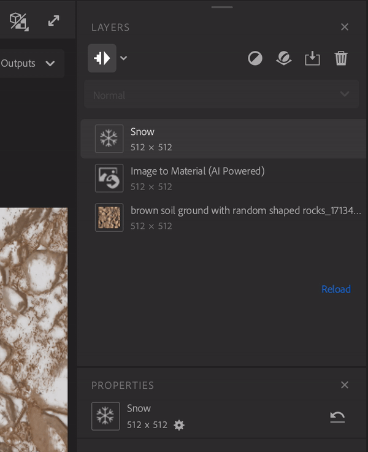

# Layer Resolution

The Layer Resolution system gives you full control over the resolution of each layer in the layer stack. A layer can either take the resolution of your document size or the resolution of the layer below.

The resolution is displayed on each layer to easily visualize how any work will be influenced by the resolution of your material.

This enables you to increase the quality of your materials, but be aware that higher resolutions can impact performance while working on your assets.

In one click, you can switch from your working resolution to a higher resolution to visualize your final material that is ready to export.

 