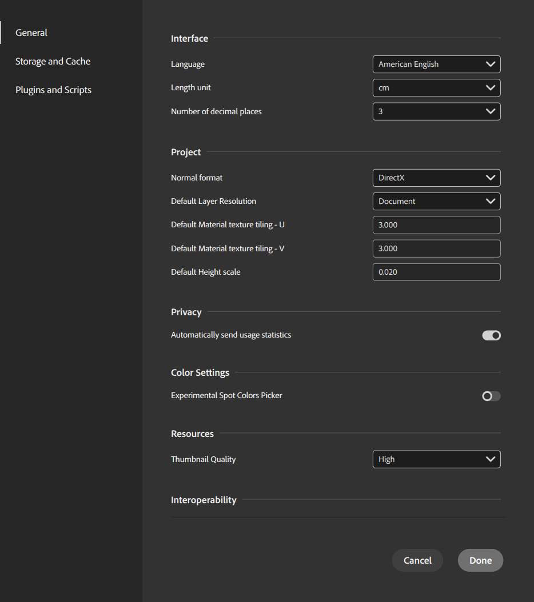

# Preferences

Use the <b>Preferences menu</b> to customize Sampler to meet your needs.

<table>
<tr style="border: 0;">
<td style="border: 0;" valign="top">

</td>
<td style="border: 0;" valign="top">

Use <b>Edit </b>&gt; <b>Preferences</b> to access the Preferences menu.

The following options are available:

## General

* <b>Interface</b>  
  * <b>Language</b>  
    Sampler currently supports the following UI languages.
    * American English
    * French
    * German
    * Japanese
    * Simplified Chinese
    * Italian
    * Spanish
    * Portuguese
* <b>Project</b>
  * <b>Normal format</b>  
    Set the normal format used in the application.
  * <b>Default Layer Resolution</b>  
    Set the default resolution strategy used in the application.
  * <b>Default Material texture tiling - U</b>  
    Set the default U texture tiling.
  * <b>Default Material texture tiling - V</b>  
    Set the default V texture tiling.
  * <b>Default Height scale</b>  
    Set the default height scale for materials.
* <b>Color Settings</b>
  * <b>Experimental Spot Colors Picker</b>  
    Enable or disable the experimental color picker wherever a color select parameter appears. The experimental color picker allows you to pick colors directly from a collection of PANTONE swatches.
* <b>Resources</b>
  * <b>Thumbnail Quality</b>  
    Adjust the quality of thumbnails in the Assets panel. Decreasing thumbnail quality can improve thumbnail loading times.
* <b>Interoperability </b>
  * <b>Send to Designer Format  
    </b>Set the format the application will send to Designer.
    * <b>SBS</b>
    * <b>SBSAR</b>
* <b>Machine Learning</b>
  * <b>GPU accelerated Neural Networks</b>  
    Enable or disable the GPU accelerated Neural Networks to improve the performances of the applications.

### Storage and Cache

* <b>Cache</b>  
  Use these settings to update cache locations.
  * Path for cache of rendered textures
  * Path for cache of thumbnails.
* <b>3D capture</b>  
  Use this setting to update the 3D capture cache location.
  * Path for 3D capture cache
* <b>Material capture</b>  
  Use this setting to update Material capture cache location.
  * Path for Material capture cache.
  * Captis IP address  
    Connect to a Captis device on your local network.
* <b>Cache storage embedded in project files</b>  
  Change how Sampler handles cached content when saving files.

### Plugins and Script

* <b>Interface</b>
  * <b>Enable Log panel</b>  
    Enable or disable the log panel.
* <b>Manage plugins</b>  
  * <b>Add a Plugin</b>
* <b>Manage scripts</b>
  * <b>Add a script</b>

</td>
</tr>
</table>
