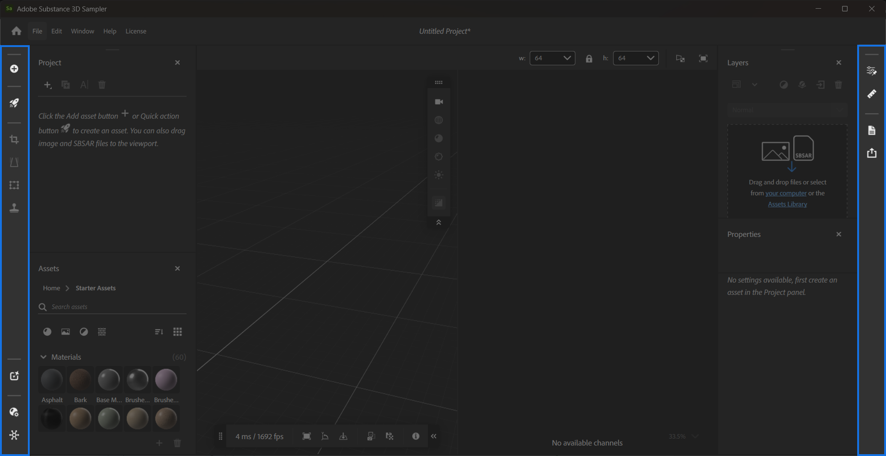

# Sidebars

Sampler has two sidebars, the **Left sidebar** and **Right sidebar**.

## Left sidebar

From the **Left sidebar** you can:

* **Add and import content**: Import images and select how they should be integrated into your project.
* **Browse 3D Assets**: Access thousands of materials from Substance 3D Assets inside Creative Cloud Desktop.
* Access **Quick actions**: A collection of actions to quickly achieve certain goals. [Learn more about **Quick Actions**](../features-and-workflows/quick-actions.md)**.**
* Quickly add filters to the layer stack:
  * **Crop:** Crop images and materials using handles in the **2D view**.
  * **Perspective transform:** Correct perspective errors with handles in the **2D view.**
  * **Transform:** Resize images and materials with handles in the **2D view.**
  * **Clone stamp:** Paint areas in the **2D view** to fix seams or other issues.
* Reopen the following panels when they are closed:
  * [The **Quick actions panel**.](panels/quick-actions-panel.md)
  * [The **Project panel**.](panels/project-panel.md)
  * [The **Assets panel**.](panels/assets-panel.md)
  * [The **Channel Settings panel**.](panels/channel-settings-panel.md)

For more information on the filters available from the **Left sidebar**, see to [Tools and Widgets](tools-and-widgets/tools-and-widgets.md).

## Right sidebar

The **Right sidebar** holds the following panels when they are closed:

* [The **Layers panel**.](panels/layers-panel.md)
* [The **Properties panel**.](panels/properties-panel.md)
* [The **Exposed Parameters Panel**.](panels/exposed-parameters-panel.md)
* [The **Physical Size panel**.](panels/physical-size-panel.md)
* [The **Metadata panel**.](panels/metadata-panel.md)
* [The **Export panel**.](panels/share-panel.md)
