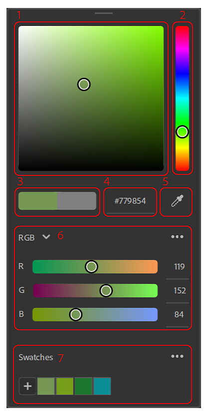
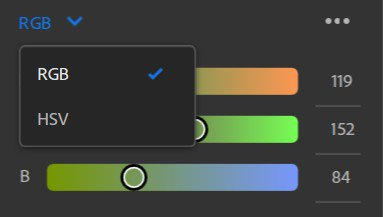
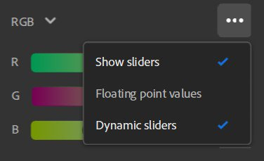
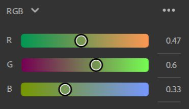
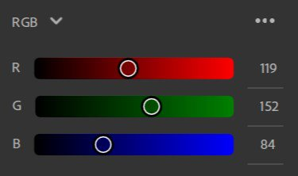
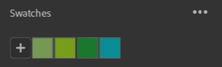
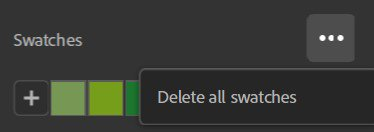
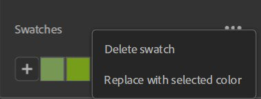

# Color Picker

The Color Picker appears every time you need to select a color.

## UI overview

{width="300px"}

1. **Color square**: Tweak the saturation and the brightness of your color with the selected hue..
1. **HUE slider**: Adjust the hue of your color.
1. **Current/Previous**: The left color is the current color of your color picker. The right color is the color you had when opening the color picker. Click on the right color to reset the current color to its original value.
1. **Hexadecimal input**: You can directly enter the hex color code of the color you want.
1. **Eyedropper**: Launch the eyedropper to pick a color from your screen. A bubble will appear next to the cursor to preview the color you will pick.
1. **Sliders**: Tweak your color using different color spaces (RGB or HSV).
1. **Swatches**: Save colors to access them quickly for future use.

### Sliders

#### Color Space

RGB (Red, Green, Blue) and HSV (Hue, Saturation, Value)are the two available color spaces.

{width="200px"}

#### Slider options

{width="200px"}

**Show Sliders**

This option allows you to hide the sliders to save space. Even with the sliders hidden, you can still modify the value inputs.

**Floating point values**

{width="200px"}

Toggle whether to use floating point or integer values for sliders. Floating point values are between 0 and 1, while integer values are between 0 and 255.

**Dynamic sliders**

Toggle whether the slider background updates dynamically as values are changed. The image below shows slider appearance when Dynamic sliders is toggled off.

{width="200px"}

### Swatches

Swatches are useful when you want to save specific colors to use across the application or several projects.

Swatches are global to Sampler and not specific per project.

Clicking on the "+" button will add a swatch with the current color as first swatch in your list.

{width="200px"}

Note: You can't add a swatch with the same color twice. The already saved swatch will be highlighted when you try to add it again.

A tooltip with the color value in Hex code is displayed when hovering a swatch.

#### Swatches options

Delete all option.

{width="200px"}

Right click on a swatch to delete it or replace it with the current color.

{width="200px"}

You can also delete a swatch by dragging and dropping it outside of the color picker.

 