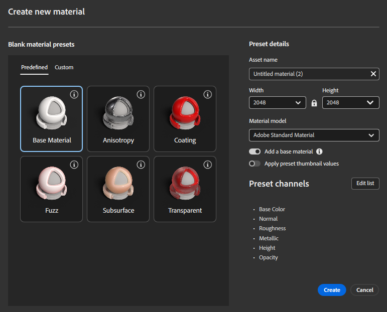

# Material creation presets

Material creation templates provide predefined starting points for building materials with advanced physical behaviour. Each template configures the material model, enabled channels, and default parameters required for a specific type of surface, allowing you to create complex materials quickly while keeping full control over the result.
Templates are available when creating a new material and can be used with both OpenPBR and ASM material models.

## Creating a material from a template

To create a material using a template:

Open the Create new material dialog.
Select a template from the Predefined or Custom tabs.
Adjust the material settings (name, resolution, material model, channels).
Click Create to start working with the configured material.

The selected template defines the initial structure of the material, including which channels are enabled and how they are set up in the Layer Stack.

## Preset categories

### Predefined templates

Predefined templates are ready‑to‑use material setups designed to cover common physical material behaviours. They encode best practices and recommended channel configurations for each use case.
Available predefined templates include:

* Base Material
A standard physically‑based material with commonly used channels enabled. Use this template for simple or generic materials that do not require specialised behaviour.

* Anisotropy
Configures the material for direction‑dependent reflections, suitable for brushed metals or surfaces with oriented micro‑details.

* Coating
Adds a secondary reflective layer on top of the base material, enabling clear‑coat or varnish‑like effects.

* Fuzz
Enables soft, light‑scattering surface effects used for fabrics, fibres, or materials with a velvety appearance.

* Subsurface
Activates subsurface light transport for materials such as wax, plastics, or organic surfaces where light penetrates below the surface.

* Transparent
Configures the material for light transmission, suitable for glass‑like or thin transparent materials.

Each predefined preset sets up the required channels and default values automatically, reducing manual setup and technical complexity.

### Custom presets

Custom presets allow you to reuse your own material configurations.
Any material preset you create can be saved as a custom template and will appear in the Custom tab. This enables consistent material creation across projects or teams, using shared standards and channel configurations.

## Preset details

The Preset details panel displays and controls the settings used to create the new material.

### Asset name

Defines the name of the material asset that will be created.

### Resolution

Controls the default resolution of the material maps (Width and Height). This resolution applies to all enabled channels when the material is created.

### Material model

Specifies the material model used by the material:

OpenPBR for modern, standardised physically‑based workflows
ASM for compatibility with existing pipelines

The selected template adapts to the chosen material model.

### Add base material

When enabled, Sampler creates a base fill layer using a base material compatible with the selected template. This provides an immediate visual result and a usable starting point. The base material is adapted to both OpenPBR and ASM material models.

### Apply preset thumbnail values

When enabled, the material is initialised with the values used to generate the template's preview thumbnail, instead of neutral defaults. This helps demonstrate the intended behaviour of the template, and to have a visual base to start building on.

### Edit list

Click **Edit list** to customise the channel set before creating the material. You can enable or disable channels as needed, or save the configuration as a new custom template.
