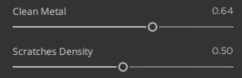

# Sliders

There is an option to animate one to several sliders. Press **Ctrl** when you hover a slider, a **play** icon will appear to launch the animation.

You can pause the animation by pressing **Ctrl** when you hover an animated slider, a **pause** icon will appear to stop the animation of this slider.

If you want pause all the sliders, press **P**. To relaunch, press **P** again.

