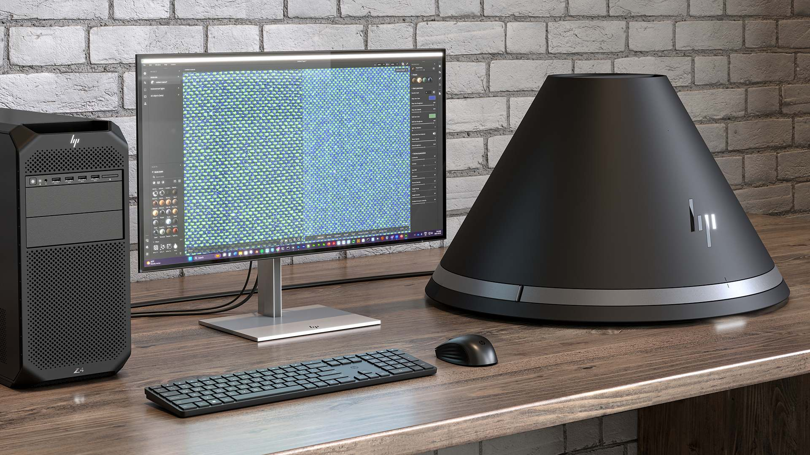

# HP Z Captis support

HP Z Captis is a material capture device, natively connected and operated by Adobe Substance 3D Sampler. Substance 3D Sampler integrates with HP Z Captis to preview and launch the capture, automatically process the PBR channels, and export a digital material.

The support for HP Z Captis is now integrated into Sampler's main build, and it is available for Enterprise, Teams and University licences.

Adobe Substance 3D Sampler and HP Z Captis device are sold separately. Please visit the official [HP Z Captis page](https://www.hp.com/us-en/workstations/z-captis.html) for more information.

Learn more: this material capture collaboration between HP and Adobe has been unveiled at Siggraph 2024: <https://www.hp.com/us-en/newsroom/blogs/2024/hp-z-captis.html>. The objective oh HP Z Captis with Sampler workflow is to enable material capture everywhere and sustainably scale 3D creation by bringing real-world materials into digital, push scanning to the supply chain, and reduce material waste.
