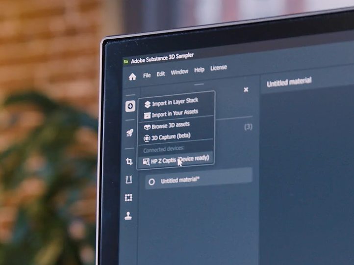
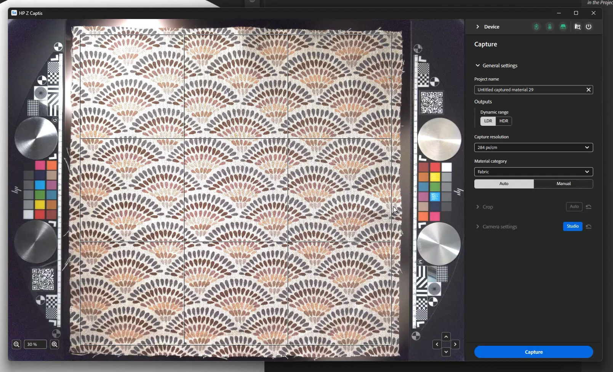
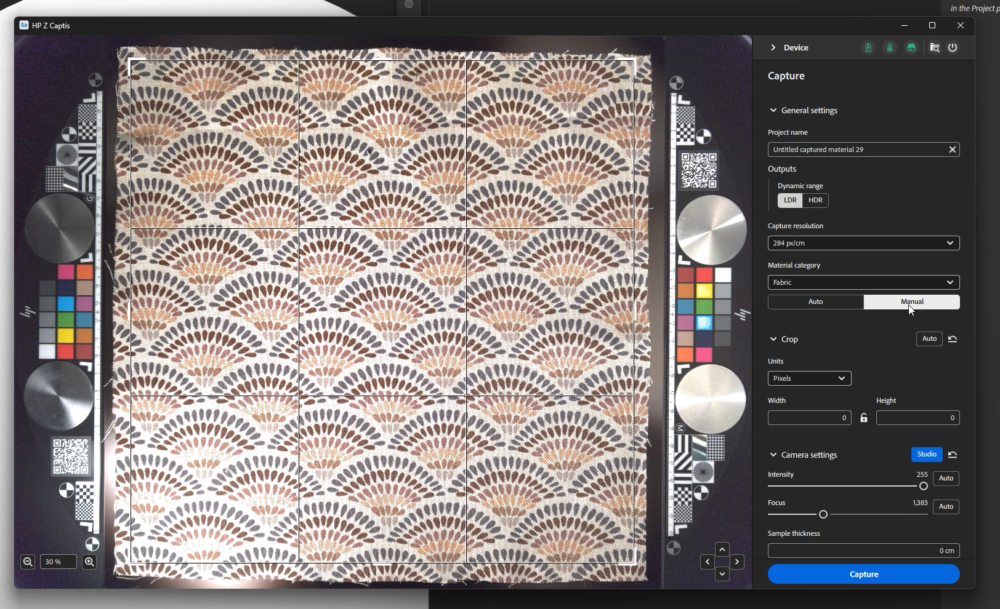
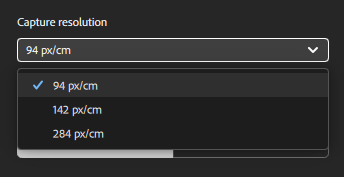
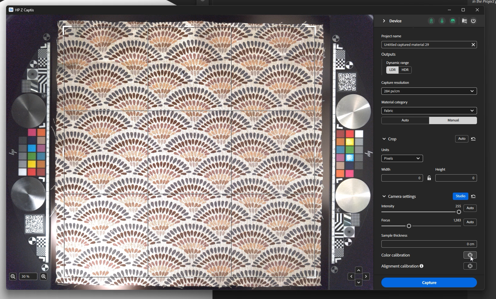
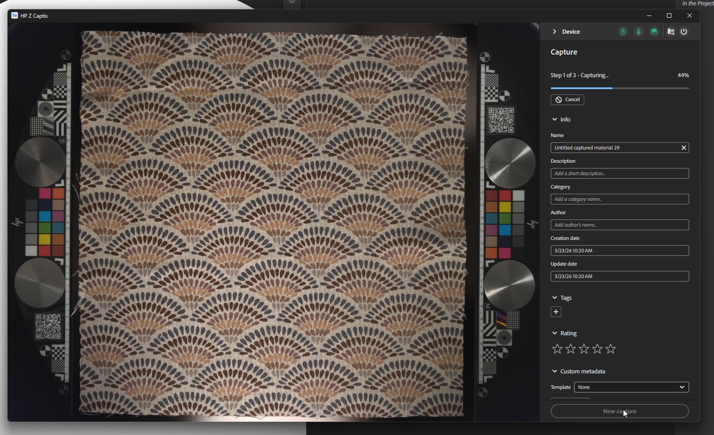
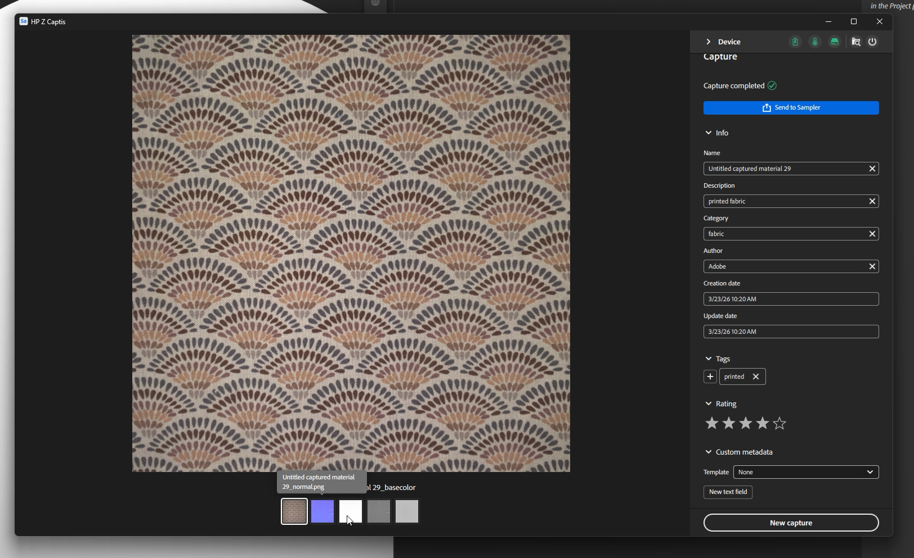
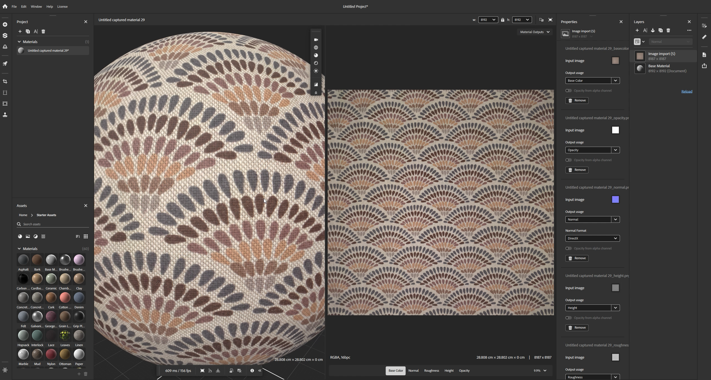

# Launch Sampler and turn on the HP Z Captis

Once Sampler is launched and that the HP Z Captis device has been plugged in to your computer, click on the Captis/cone icon on the left bar.

If you do not see the HP Z Captis appearing in the UI, please refer to the FAQ.

After clicking on HP Z Captis, a dedicated window opens with 3 options:

1. <b>Browse content</b>: It will open your file explorer to browse the local storage of your HP Z Captis device.
1. <b>Start scanning</b>: It will initialize HP Z Captis device and start the capture flow.
1. <b>Shut down</b>: It will shut down the device and close the window.

## Closing HP Z Captis window

At any moment if you close the HP Z Captis window you will be asked if you want to <b>continue the process</b> or <b>abort</b>.

If you select continue, the device will proceed with its current task offline and pause at the end of the current step. You can reconnect Sampler later to continue to the next step of the capture session.

## Preview step

Sampler will initialise the Preview of HP Z Captis device. It is recommended to <b>not interact </b>with the view while it is initialising.

In this new update, there are two modes: Auto and Manual.

### General settings

#### Auto mode

You now have the possibility to launch the capture in one click: Sampler will:

* define a default name, 
* define automatically the region of interest (ROI)/crop zone using the backlight, 
* make the focus on the full ROI, and 
* change the intensity setting to one adapted to your material.

If you have made captures previously, the material category, outputs and capture resolution selected will be the same ones as your previous capture. 

#### Manual mode

You can also choose to define some of the settings by hand:

*Project name*

You can define a project name of your capture and define which type of outputs you want to retrieve.

*Outputs*

* By default only the material PBR channels (Base color, normal, height and opacity) will be saved.  
  You have the possibility to choose the output type between LDR (low dynamic range) and HDR (high dynamic range).

*Capture resolution*

* 239 px/in - 94 px/cm (Preview: lower quality, quicker scan)
* px/in - 142 px/cm (Default: high quality, easily maneageable in the majority of workflows - equivalent to 4k for 30x30cm capture)
* 718px/in - 284 px/cm (Full resolution - equivalent to 8k for 30x30cm capture)

Note: Only PBR channels will be loaded in Sampler.  
The default folder captures are saved in can be modified in the preferences.

<b>Material category</b>

Set this to the type of material you are scanning for map genereation fine-tuned to your particular material.  
The default category selected is "Fabric". It will help optimize the result of your roughness channel.

If what you are scanning contains several types of materials, please select the category of the largest one.

<b>Crop</b>

The crop can be done automatically or manually.

The auto crop will be using the backlight to define the outline of the material, and place the Region of interest (ROI) around it. It is not adapted when digitizing several material samples at once, or when the material is very transparant.
In that case, the ROI can be defined by dragging the corners of the crop widget in the preview, or by setting a defined resolution or physical size.

<b>Camera settings </b>

* Intensity: Adjust the camera exposure.  
  Clicking on Auto will use the center of the ROI to define the best intensity for the material.

* Focus: It will adjust the camera focus.  
  Clicking on Auto will define the ideal focus using the full ROI.
  This new focus algorithm, where the focus is not on a single point anymore, allows for a more uniform focus on the digitized material, leading to higher quality scans which are easier to make tileable.

You can set both by hand if you prefer.

<b>Other settings</b>

Other types of settings<b> only have to be modified on occasion</b>: the color and alignment calibration.

* Color calibration

Calibrate the color of the base color map thanks to the HP Z Captis technical areas.   
This will result in the final material being the exact same color as the sample you added in the HP Z Captis tray.  
The technical areas with the color swatches are automatically detected and are used for the calibation. They have to be placed in their specific space on each side of the sample.

This is only available in Studio mode. Please make sure to do the focus before this color calibration.

This calibration has to be done <b>every few months</b>. It is not necessary to do it fo every scan or each time the device is used.

* Alignment calibration

This alignment <b>has to be done</b> the <b>first time you set up your device</b>, every time you physically move it and then every couple of months. It is <b>not necessary</b> to do this process <b>for every capture</b>.

Please make sure to do the focus before this alignment calibration.

To do the alignment please <b>place something with sharp and clear information, like a piece of paper with printed text, in the center of the capture space</b>, close the drawer and click on the alignment button. Once this is done you can make sure everything is in place, with the technical areas in their place on each side of the scanning space, a material placed in the center and if necessary held in place with the magnets supplied with the HP Z Captis device, and you can start scanning your materials.

Once you are all set: <b>start the scan</b>.

## Capture, processing and copy steps

Once the scan starts, the preview will display photos taken during the process.

The processing part is split in three parts:

* <b>Capture</b>: Taking all required photos

* <b>Processing</b>: Processing the photos to generate PBR channels (Base color, normal, height, opacity)

* <b>Copying</b>: Copying the results from the HP Z Captis device to your computer

While it is capturing and processing, you can add metadata (same metadata that you will find in Sampler metadata panel).

During the processing, you will see the result is built tile by tile.

## Summary step

At this step you can review the results of the scan. All the created channels are displayed (in Explorer mode, no opacity is created since the explorer ring does not have a backlight).

You can choose to send you material to Sampler, to add it to your project and start processing it.
You can also start directly a new capture without adding it to the project.
In both cases you will find your scanned maps in the equivalent folder on your computer: C:\Users\username\Documents\Adobe\Adobe Substance 3D Sampler\Captis\Material

## Material edition

After exiting HP Z Captis window, the channels (base color, normal, height, roughness and opacity if relevant) will be added as a layer in the Layers panel.

Use Sampler filters (Equalize, Perspective Crop, Tiling, …) to process and clean your material.

Once you are done, you can:

* Save your Sampler project: File &gt; Save as … (Ctrl + S)

* Export your material: File &gt; Export … (Ctrl + E)

